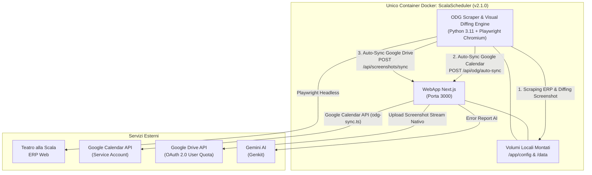
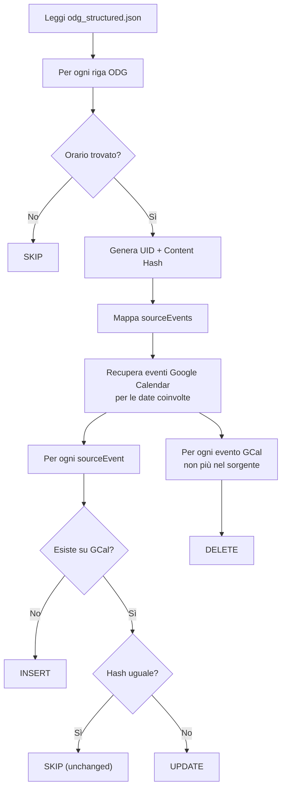
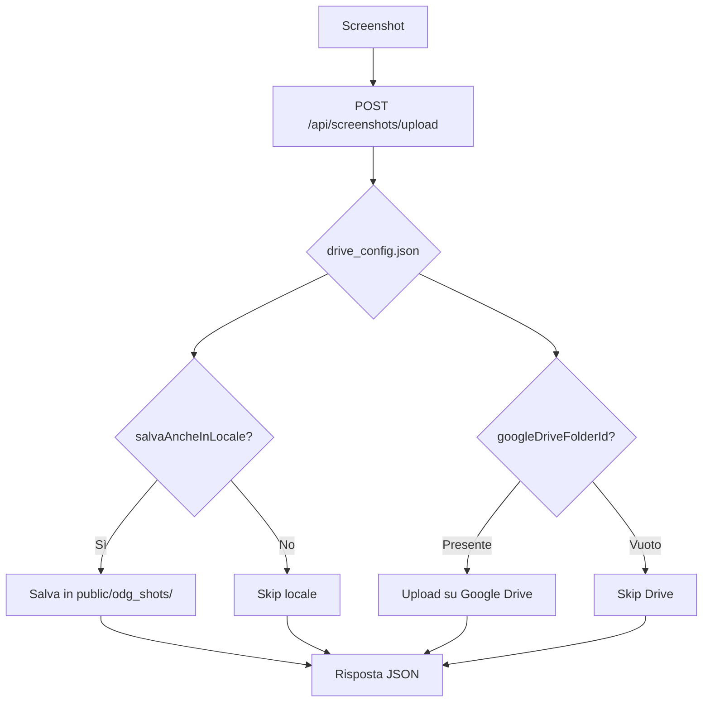

# ScalaScheduler — Analisi Tecnica Completa

> **Progetto**: Chorus Calendar Sync (aka "ScalaScheduler")
> **Autore**: ciacky85 (Carlo)
> **Scopo**: Estrarre gli eventi dai programmi di lavoro del Coro del Teatro alla Scala (PDF e pagine web) e sincronizzarli su calendari Google tramite Service Account. Rilevare modifiche visive giornaliere con visual diffing e archiviare gli screenshot su Google Drive con autenticazione OAuth 2.0.
> **Data analisi iniziale**: 01/09/2026
> **Versione attuale**: **v2.2.0** (08/09/2026) — **Navigatore Screenshot a Calendario & Rilevamento Storico Variazioni**: Calendario web interattivo a griglia mensile per screenshot ODG con badge visivo evidenziato (`+{editsCount}`) per date con modifiche (3+ screenshot o `_edit.png`), scansione storica profonda del filesystem su tutti i formati cartella, dialog di confronto affiancato e viewer con zoom.

---

## 1. Panoramica Architetturale (v2.2.0)

A partire dalla release **v2.0.0** e consolidata con la **v2.1.0**, l'architettura opera in un **singolo container Docker unificato** multi-stage basato su `node:20-bookworm-slim` (Debian). La WebApp Next.js e il motore di scraping Python con Playwright Chromium comunicano localmente su `localhost:3000` con latenza zero.

Nella versione **v2.1.0**, il processo Python `main.py` gestisce la schedulazione autonoma: al termine di ogni estrazione e diffing visuale degli screenshot (`shots.py`), notifica immediatamente la WebApp tramite la nuova route `POST /api/odg/auto-sync` e avvia la sincronizzazione automatica verso Google Drive (`POST /api/screenshots/sync`). Il vecchio container cron e i relativi script runner sono stati rimossi.



### Componenti del Repository

| Modulo / File | Linguaggio / Tipo | Ruolo |
|---------------|-------------------|-------|
| `Dockerfile` | Docker Multi-Stage | Build unificato: compila Next.js standalone, installa Python 3.11, Playwright Chromium headless e dipendenze di sistema grafiche su Debian Bookworm. |
| `docker-compose.yml` | Docker Compose | Stack a singolo servizio `scala-scheduler` per Portainer con mappatura diretta dei volumi `/app/config` e `/data`. |
| `scheduler/` | TypeScript / Next.js 15 | WebApp principale: gestione calendari, import PDF, interfaccia ODG, sincronizzazione Google Drive, autenticazione RBAC e API di backend. |
| `odg-docker-scraper/` | Python 3.11 / Playwright | Motore di scraping headless e cattura screenshot con watermark per l'ERP del teatro. |
| `version.json` | JSON | File tracciato alla radice per l'allineamento di versione e changelog tra codice e runtime. |

---

## 2. Modulo: ODG Docker Scraper (`odg-docker-scraper/`)

### 2.1 Tecnologie
- **Python 3.11** (nel container unificato `node:20-bookworm-slim` con virtual environment isolato)
- **Dipendenze**: `playwright` (Chromium headless), `requests`, `beautifulsoup4`, `lxml`, `Pillow`

### 2.2 File Principali

| File | Funzione |
|------|----------|
| [`main.py`](file:///c:/Users/carlo/Desktop/ProgettiAntiGravity/ScalaScheduler/odg-docker-scraper/main.py) | Orchestratore unico: scraping ERP, parsing strutturato, invocazione screenshot diffing, trigger sequenziale API `auto-sync` e `screenshots/sync` |
| [`shots.py`](file:///c:/Users/carlo/Desktop/ProgettiAntiGravity/ScalaScheduler/odg-docker-scraper/shots.py) | **[AGGIORNATO v2.1.0]** Visual Diffing & Cattura Screenshot Playwright: hashing contenuti, baseline 00:02 (`YYYY-MM-DD.png`), scatti di modifica (`_edit.png`), watermark timestamp e deduplicazione scatti invariati |
| [`drive_uploader.py`](file:///c:/Users/carlo/Desktop/ProgettiAntiGravity/ScalaScheduler/odg-docker-scraper/drive_uploader.py) | Helper per caricamento screenshot locali su Google Drive tramite API di backend |
| [`Dockerfile`](file:///c:/Users/carlo/Desktop/ProgettiAntiGravity/ScalaScheduler/odg-docker-scraper/Dockerfile) | Dockerfile stand-alone (opzionale se eseguito scorporato) |
| [`config.json.example`](file:///c:/Users/carlo/Desktop/ProgettiAntiGravity/ScalaScheduler/odg-docker-scraper/config.json.example) | Template di configurazione con orari schedules, credenziali e percorsi |

### 2.3 Funzionamento & Pipeline Unificata (v2.1.0)
1. **Fetch & Parsing HTML**: interroga le pagine del portale ERP della Scala (`pxf_dspagine_coro.xhtml?pps=0` e `pps=1`) tramite Playwright/requests.
2. **Estrazione Dati Strutturata**: estrae data ISO, etichetta giorno, timestamp di aggiornamento e righe tabella (destinatario, luogo normalizzato, orario, descrizione).
3. **Gestione Note & Asterischi**: associa deterministicamente i testi dei piè di pagina contrassegnati con asterisco `*` direttamente alla descrizione della riga di pertinenza.
4. **Scrittura JSON**: persiste i dati in `/data/odg_structured.json`.
5. **Visual Diffing & Shot Management (`shots.py`)**:
   - Calcola l'hash SHA-256 del contenuto visibile/HTML della pagina (`last_page_hashes`).
   - Se è il primo ciclo del giorno (o lo scatto baseline manca), genera la baseline: `odg_shots/YYYY-MM/YYYY-MM-DD.png`.
   - Nei cicli successivi della giornata:
     - Se l'hash è **diverso** rispetto all'ultimo rilevato, acquisisce un nuovo scatto evidenziando la modifica: `odg_shots/YYYY-MM/YYYY-MM-DD_HHmm_edit.png`.
     - Se l'hash è **identico**, evita scatti ridondanti risparmiando spazio disco e chiamate Drive API.
   - Applica a ciascuna immagine un watermark in sovrimpressione con data e ora esatta.
6. **Auto-Sync Google Calendar**: `main.py` invia una richiesta HTTP `POST http://localhost:3000/api/odg/auto-sync` per sincronizzare immediatamente gli eventi estratti sul calendario Google.
7. **Sync Google Drive**: `main.py` invia `POST http://localhost:3000/api/screenshots/sync` per caricare i nuovi screenshot su Google Drive tramite Folder-First Diff ad alte prestazioni.
8. **Scheduling & Controllo Modifiche 5 Minuti**:
   - **Orari pianificati (`schedules`)**: esegue l'intera pipeline di scraping, analisi, diffing e push calendar agli orari impostati da interfaccia (default `07:00`, `21:00`).
   - **Controllo ogni 5 minuti con Push Immediato**: ad ogni iterazione di 5 minuti, confronta l'hash canonico della pagina (`canonical_hash`). Se viene rilevata una modifica nei dati o negli orari, esegue istantaneamente l'analisi, aggiorna il file schematico `/data/odg_structured.json` e lancia **immediatamente il push su Google Calendar ODG** e la sincronizzazione Drive, senza attendere l'orario programmato successivo.

### 2.4 Schema Output (`odg_structured.json`)

```json
{
  "export_generated_at": "2025-11-11T00:01:00+01:00",
  "pages": [
    {
      "source_url": "https://erp.teatroallascala.org/...",
      "date": { "label": "Martedì 11 Novembre 2025", "iso": "2025-11-11" },
      "last_update": { "raw": "Agg. 07/11/2025 17:00", "iso": "2025-11-07T17:00+01:00" },
      "table": {
        "columns": [
          { "key": "recipient", "label": "Destinatario" },
          { "key": "place", "label": "Luogo" },
          { "key": "time", "label": "Fascia oraria" },
          { "key": "description", "label": "Descrizione" }
        ],
        "rows": [
          {
            "row_index": 0,
            "recipient": { "raw": "CORO UOMINI", "normalized": "Coro Uomini", "category": "coro" },
            "place": { "raw": "IN SALA", "normalized": "In Sala", "location_type": "sala" },
            "time": { "raw": "14:00 - 15:30", "start": "14:00", "end": "15:30", "tz": "Europe/Rome" },
            "description": {
              "raw": "LADY MACBETH * 6° PIANO...",
              "title": "LADY MACBETH * 6° PIANO",
              "details": ["*ore 14:00 \"LA VOCE DI BORIS\"", "ore 14:30 CORO UOMINI TUTTO"],
              "flags": ["asterisk"]
            },
            "provenance": { "tokens": ["CORO UOMINI", "IN SALA", "14:00 - 15:30", "..."] }
          }
        ]
      },
      "stats": { "row_count": 3 }
    }
  ]
}
```

> [!IMPORTANT]
> Lo schema `odg_structured.json` è il **contratto di interfaccia** tra scraper e scheduler. Ogni modifica allo schema deve essere sincronizzata su entrambi i moduli.

### 2.5 Classificazione Luoghi (Python)
```python
"ansaldo" → "ansaldo"
"sala"    → "sala"
"teatro"  → "teatro"
"ridotto" → "ridotto"
"palco"   → "palco"
"studio"  → "studio"
_         → "altro"
```

---

## 3. Modulo: Scheduler App (`scheduler/`)

### 3.1 Stack Tecnologico

| Tecnologia | Versione | Uso |
|-----------|---------|-----|
| **Next.js** | 15.3.3 | Framework full-stack (App Router) |
| **React** | 18.3.1 | UI |
| **TypeScript** | ^5 | Type safety |
| **TailwindCSS** | ^3.4.1 | Styling |
| **shadcn/ui** | (Radix UI) | Componenti UI |
| **pdfjs-dist** | 4.2.67 | Parsing PDF client-side |
| **googleapis** | 140.0.1 | Google Calendar API |
| **google-auth-library** | 9.11.0 | Auth Service Account |
| **Genkit** | 1.20.0 | AI (Gemini 2.5 Flash) |
| **Framer Motion** | 11.5.7 | Animazioni |
| **date-fns** / **date-fns-tz** | 3.x | Gestione date/timezone |

### 3.2 Struttura Directory (con alias `@/`)

Il progetto usa `src/` come radice mappata all'alias `@/`. I file a root level (`page.tsx`, `layout.tsx`, ecc.) sono duplicati nella cartella `app/` e `src/app/`.

```
scheduler/
├── src/
│   ├── ai/                          # Modulo AI (Genkit)
│   │   ├── genkit.ts                # Configurazione Genkit + Google AI plugin
│   │   ├── dev.ts                   # Dev entry per Genkit CLI
│   │   └── flows/
│   │       └── generate-export-error-report.ts  # Flow AI per report errori
│   ├── app/
│   │   ├── layout.tsx               # Root layout (fonts, providers)
│   │   ├── page.tsx                 # Home page (Login Gate + 5 tabs con RBAC)
│   │   ├── globals.css              # CSS con variabili tema
│   │   ├── config/
│   │   │   ├── calendars.json       # Configurazione calendari Google (con ownerUserId)
│   │   │   ├── users.json           # Database utenti (password in chiaro, ruoli admin/user)
│   │   │   ├── drive_config.json    # Config Google Drive (OAuth 2.0 user quota, URL cartella, salva locale)
│   │   │   └── service-account-key.json  # Chiave SA Google (SEGRETO)
│   │   ├── api/
│   │   │   ├── auth/                # API Autenticazione
│   │   │   │   ├── login/route.ts   # POST: login con cookie session auth-token
│   │   │   │   ├── logout/route.ts  # POST: logout (clear cookie)
│   │   │   │   ├── me/route.ts      # GET: profilo utente corrente
│   │   │   │   └── register/route.ts # POST: registrazione nuovo utente (stato pending)
│   │   │   ├── admin/               # API Admin
│   │   │   │   └── users/
│   │   │   │       ├── route.ts     # GET/POST: lista utenti / crea utente
│   │   │   │       └── [id]/route.ts # PUT/DELETE: modifica/approva/elimina utente
│   │   │   ├── calendars/route.ts   # GET/POST: calendari con ownerUserId e ownerName
│   │   │   ├── settings/
│   │   │   │   └── drive/route.ts   # GET/POST: config Google Drive screenshot
│   │   │   ├── screenshots/
│   │   │   │   ├── image/route.ts   # [NUOVO v2.1.0] GET: streaming sicuro screenshot PNG locali
│   │   │   │   ├── sync/route.ts    # [NUOVO v2.1.0] POST: trigger sincronizzazione screenshot su Drive
│   │   │   │   └── upload/route.ts  # POST: upload screenshot singolo → Drive + locale
│   │   │   ├── scraper/             # API Scraper Manager
│   │   │   │   ├── config/route.ts  # GET/POST: configurazione scraper
│   │   │   │   ├── run/route.ts     # POST: esecuzione on-demand
│   │   │   │   └── status/route.ts  # GET: stato scraper
│   │   │   └── odg/
│   │   │       ├── auto-sync/route.ts  # [NUOVO v2.1.0] POST: auto-sync automatico chiamato da main.py
│   │   │       ├── modifications/route.ts # [NUOVO v2.1.0] GET: elenco cronologico modifiche e screenshot
│   │   │       └── push/route.ts    # POST: push manuale ODG → Google Calendar
│   │   └── components/
│   │       ├── odg-tab.tsx          # Tab "ODG" (integra tabella eventi e registro modifiche)
│   │       ├── odg-modifications-view.tsx # [NUOVO v2.1.0] Componente visual diffing, zoom e modale
│   │       ├── importa-calendario-tab.tsx  # Tab "Importa Calendario"
│   │       ├── impostazioni-tab.tsx # Tab "Impostazioni" (Admin: hub calendari + Drive)
│   │       ├── tabella-calendario.tsx  # Tabella eventi editabile
│   │       ├── export-controls.tsx  # Controlli esportazione (select cal + pulsante)
│   │       ├── admin/               # Componenti Admin
│   │       │   ├── gestione-utenti-tab.tsx  # Tab "Utenti" (gestione account e approvazioni)
│   │       │   └── scraper-manager-tab.tsx  # Tab "Scraper"
│   │       └── importa-calendario/
│   │           └── upload-pdf.tsx   # Upload + trigger parsing PDF
│   ├── components/ui/              # 35 componenti shadcn/ui
│   ├── contexts/
│   │   ├── auth-context.tsx         # Provider autenticazione + RBAC + isCalendarAllowed
│   │   ├── settings-context.tsx     # Provider impostazioni app
│   │   └── calendar-context.tsx     # Provider gestione calendari
│   ├── hooks/
│   │   ├── use-toast.ts            # Hook toast notifications
│   │   └── use-mobile.tsx          # Hook responsive
│   ├── version.ts                  # [v2.1.0] Costanti APP_VERSION, APP_BUILD_DATE, APP_CHANGELOG
│   └── lib/
│       ├── types.ts                # Tipi TypeScript condivisi (+ ownerUserId, UserProfile, UserRole)
│       ├── utils.ts                # cn() per classi CSS
│       ├── constants.ts            # Costanti (TIMEZONE)
│       ├── auth/                    # Modulo Autenticazione
│       │   └── users-store.ts      # Lettura/scrittura users.json
│       ├── calendar/
│       │   ├── export-events.ts    # Logica esportazione PDF → Google Cal
│       │   └── odg-sync.ts         # [NUOVO v2.1.0] Motore unificato e DRY per sync ODG → Google Cal
│       ├── drive/
│       │   └── google-drive.ts     # Integrazione Google Drive (auth, upload stream nativo, Folder-First Diff)
│       ├── pdf/
│       │   └── estraiProgrammaCoro.ts  # Parser PDF (client-side)
│       ├── settings/
│       │   └── store.ts            # Persistenza settings (localStorage) (+ defaults Drive)
│       └── utils/
│           └── date.ts             # Utility date
├── Dockerfile                       # Multi-stage build standalone (deps → build → run) ~180 MB
├── docker-compose.yml               # Configurazione docker-compose locale
├── entrypoint-wrapper.sh            # Entrypoint Docker: avvia scraper daemon + server Next.js
├── apphosting.yaml                  # Config Firebase App Hosting
└── public/
    ├── odg_structured.json          # Dati ODG (shared con scraper via volume)
    ├── odg_shots/                   # Screenshot salvati in locale (se abilitato)
    └── odg_sync.log                 # Log sincronizzazione
```

### 3.3 Login Gate & Autenticazione — **[NUOVO]**

L'applicazione implementa un **Access Gate obbligatorio**: se l'utente non è autenticato, l'intera interfaccia è bloccata e viene mostrato esclusivamente il modulo di Login / Registrazione centrato a schermo.

**Componenti**:
- **`auth-context.tsx`**: React Context Provider che gestisce lo stato di autenticazione, il profilo utente, le funzioni `login()`, `logout()`, `register()`, e la funzione `isCalendarAllowed(calendarId)` per il filtraggio per-utente.
- **`users-store.ts`**: Modulo server-side per lettura/scrittura del file `user.json` (e fallback `users.json`). Le **password sono gestite e salvate in chiaro** (requisito di progetto).
- **API Routes**: `/api/auth/login`, `/api/auth/logout`, `/api/auth/me`, `/api/auth/register`.
- **Cookie di sessione**: `auth-token` (cookie HTTP-only) contenente l'ID utente.

**Flusso Login**:
1. Utente inserisce username e password.
2. POST `/api/auth/login` → verifica `inputPassword.trim() === user.password.trim()` (chiaro).
3. Se OK → set cookie `auth-token` e redirect alla home.
4. Se KO → messaggio "Credenziali non valide".

**Flusso Registrazione**:
1. Utente compila nome, email, password.
2. POST `/api/auth/register` → crea record con `status: 'pending'`.
3. L'admin vede la richiesta nella scheda "Utenti" e può approvarla/rifiutarla.

### 3.4 L'Interfaccia Web — 5 Tab con RBAC

> **Visibilità Tab per Ruolo:**
> | Tab | Admin | Artista del Coro |
> |-----|:-----:|:-------:|
> | Importa Calendario | ✅ | ✅ (solo proprio calendario) |
> | ODG | ✅ | ✅ |
> | Impostazioni | ✅ | ❌ |
> | Scraper | ✅ | ❌ |
> | Utenti | ✅ | ❌ |

#### Tab 1: "Importa Calendario" (Parsing PDF) — Visibile a tutti
**Flusso**:
1. L'utente carica un file PDF (programma quindicinale prove del coro)
2. [`estraiProgrammaCoro.ts`](file:///c:/Users/carlo/Desktop/ProgettiAntiGravity/ScalaScheduler/scheduler/src/lib/pdf/estraiProgrammaCoro.ts) esegue il parsing **client-side** con `pdfjs-dist`
3. Il parser:
   - Ricostruisce le righe di testo raggruppando gli item per coordinata Y
   - Identifica mese/anno dall'intestazione
   - Rileva le note a piè di pagina (linee con `*`)
   - Itera le righe cercando pattern `<giorno> <data>` come intestazioni giornaliere
   - Estrae orari con regex (supporta `HH:mm`, `HH.mm`, range con `-`, `–`, `—`)
   - Deduce luoghi da keyword (`PALCOSCENICO`, `SALA PROVE`, `RIDOTTO`, `ANSALDO`, etc.)
   - Gestisce asterischi concatenando il significato dal piè di pagina (de-dup)
   - Gestisce stati `ok` / `da_revisionare` (date non riconosciute)
4. Viene mostrata una **tabella editabile** ([`tabella-calendario.tsx`](file:///c:/Users/carlo/Desktop/ProgettiAntiGravity/ScalaScheduler/scheduler/src/app/components/tabella-calendario.tsx)):
   - Checkbox per selezione/deselezione
   - Campi editabili: descrizione, luogo, fasce orarie (1 e 2), data (con date picker)
   - Filtro testuale, ordinamento, selezione multipla
   - Badge "Da Revisionare" per righe problematiche
5. **Filtraggio per proprietario**: un utente Artista del Coro vede nel dropdown solo i calendari di cui è proprietario (`ownerUserId === user.id`). Gli admin vedono tutti.
6. Pulsante "Esporta su Google Calendar" → [`export-events.ts`](file:///c:/Users/carlo/Desktop/ProgettiAntiGravity/ScalaScheduler/scheduler/src/lib/calendar/export-events.ts) (Server Action)

#### Tab 2: "ODG" (Ordine del Giorno da Web) — Visibile a tutti
La scheda include due sotto-viste selezionabili tramite tabs interne:

1. **Sotto-scheda "Programma ODG & Push"**:
   - Carica `/odg_structured.json` (via fetch, prodotto dallo scraper)
   - Mostra tabella **read-only** con data/destinatario/luogo/orario/descrizione
   - Seleziona il calendario di destinazione e invia il push tramite API `/api/odg/push` (motore `odg-sync.ts`)
   - Supporta **Dry Run** (simulazione senza modifiche al calendario Google)
   - Mostra riepilogo dettagliato del sync: scansionati, inseriti, aggiornati, rimossi, invariati

2. **Sotto-scheda "Modifiche Rilevate & Screenshot"** (e sotto-scheda dedicata in Scraper Manager) — **[AGGIORNATO v2.1.0]**:
   - **Calendario Interattivo Mensile**:
     - Navigazione mese per mese con pulsante "Oggi" e supporto localizzato in italiano.
     - **Segno di riconoscimento visivo per giorni con modifiche**: ogni cella del calendario che contiene screenshot di modifica (`_edit.png`), file con timestamp di modifica, oppure **3 o più screenshot nella giornata** (poiché la routine normale genera solo le 2 baseline ODG 0 e ODG 1), presenta un bordo ambrato ben visibile, sfondo evidenziato e un badge con contatore (`+{editsCount}`) per consentire all'utente di individuare a colpo d'occhio i giorni in cui sono intervenute variazioni al programma.
     - **Scansione Storica Approfondita del Filesystem**: l'endpoint `/api/odg/modifications` scansiona l'intero albero di cartelle locali (`YYYY-MM-DD`, `DD-MM-YYYY`, cartelle mensili `YYYY-MM/` e file sciolti) costruendo una mappa globale `datesSummary` di tutte le date esistenti, indipendentemente dalla data singola visualizzata nel viewer di dettaglio.
     - Indicatore verde discreto per i giorni con sola baseline regolare (invariata).
     - **Accesso rapido "Giorni con Variazioni Rilevate"**: elenco compatto di scorciatoie per saltare istantaneamente con un click a qualsiasi data che presenti modifiche.
   - **Visualizzatore Dettagli Giornata**:
     - Elenco cronologico degli screenshot di modifica con orario esatto, pagina e anteprima.
     - **Confronto Diretto (Baseline vs Modifica)**: finestra modale affiancata per vedere a colpo d'occhio le differenze tra lo scatto delle 00:02 e la modifica rilevata.
     - **Dialog a Schermo Intero con Zoom**: controlli di zoom in / zoom out, reset al 100%, visualizzazione ad alta definizione, apertura su Google Drive e download diretto del PNG.
     - Sezione dedicata alla **Baseline Iniziale delle 00:02**.

#### Tab 3: "Impostazioni" (Solo Admin)
- **Service Account**: mostra email del service account da aggiungere con permessi di scrittura a Google Calendar e con ruolo **Editor** alla cartella di Google Drive.
- **Hub Unico Gestione Calendari**: tabella centralizzata per TUTTI i calendari con:
  - CRUD completo (aggiunta, modifica, eliminazione)
  - Campi: etichetta, calendarId, tipo (importaCalendario/odg), predefinito
  - **Assegnazione Proprietario (`ownerUserId`)**: menu a tendina con tutti gli utenti registrati per associare ogni calendario al suo artista del Coro proprietario
  - Badge con nome proprietario nella colonna dedicata
- **Salvataggio Screenshot su Google Drive**:
  - Input link/ID cartella Google Drive per gli screenshot
  - Toggle switch "Salva anche in locale"
  - Pulsante per testare la connessione con **diagnostica errori dettagliata** (mostra il messaggio originale dell'API Google, con suggerimento di abilitare la Google Drive API se necessario)
  - Configurazione persistita in `config/drive_config.json`

#### Tab 4: "Scraper" (Solo Admin)
- **Dashboard Stato**: mostra data/ora ultimo scraping, pagine analizzate, righe totali e dettaglio per data.
- **Esecuzione Manuale On-Demand**: pulsante "Esegui Scraper Adesso" per forzare il refresh immediato dei dati senza attendere il cron.
- **Configurazione URL Pagine ERP**: interfaccia per visualizzare, aggiungere, rimuovere e modificare le URL target.
- **Configurazione Schedulazioni (`schedules`)**: gestione degli orari di scansione (es. `07:00`, `21:00`).
- **Opzione `run_on_start`**: toggle per scansione immediata all'avvio del container.
- **Persistenza**: salva direttamente in `config.json` sul volume condiviso Portainer `/srv/docker_conf/configs/ScalaScheduler/odg-scraper/config`.

#### Tab 5: "Utenti" (Solo Admin)
- **Richieste in attesa**: sezione dedicata con pulsanti Approva/Rifiuta per le registrazioni pendenti.
- **Elenco utenti**: tabella con nome, username, email, ruolo (Admin/Artista del Coro), stato account.
- **Modifica utente**: popup con form pulito per aggiornare Nome, Username, Email, Password, Ruolo e Stato. **Nessuna gestione calendari** in questa scheda (centralizzata in Impostazioni).
- **Creazione manuale**: pulsante per creare un account direttamente con status "approvato".
- **Eliminazione**: pulsante per rimuovere un account.

### 3.5 Tipi TypeScript Principali

```typescript
// lib/types.ts
interface RigaCalendario {
  id: string;           // UUID
  selected: boolean;    // checkbox
  giornoSettimanale: string;  // "Lunedì" ...
  data: string;         // "dd/MM/yyyy"
  descrizione: string;
  dettaglio: string;
  luogo: string;
  fascia1Start?: string;  // "HH:mm"
  fascia1End?: string;
  fascia2Start?: string;
  fascia2End?: string;
  stato?: 'ok' | 'da_revisionare';
  rawText?: string;
}

interface ImpostazioniCalendario {
  id: string;
  label: string;
  calendarId: string;       // ID Google Calendar
  tipo: 'importaCalendario' | 'odg';
  predefinito?: boolean;
  ownerUserId?: string;     // [NUOVO] UUID del proprietario (da user.json)
}

// [NUOVO] Profilo utente (persistito in user.json)
type UserRole = 'admin' | 'user';
type UserStatus = 'approved' | 'pending' | 'disabled' | 'rejected';

interface UserProfile {
  id: string;                     // UUID v4
  username: string;               // Email di accesso
  nome: string;                   // Nome e Cognome
  email: string;
  password: string;               // Password in CHIARO (requisito di progetto)
  role: UserRole;                 // 'admin' | 'user'
  status: UserStatus;             // 'approved' | 'pending' | 'disabled' | 'rejected'
  assignedCalendarIds: string[];  // Array di calendarId Google associati
  createdAt: string;              // ISO-8601
  approvedAt?: string;            // ISO-8601 (quando approvato dall'admin)
}

interface AppSettings {
  calendari: ImpostazioniCalendario[];
  durataDefaultMin: number;
  timezone: 'Europe/Rome';
  consentiDateFuoriMese: boolean;
  exportMode: 'oauth' | 'serviceAccount';
  googleDriveFolderUrl?: string;
  salvaAncheInLocale?: boolean;
}

// Configurazione persistita server-side (drive_config.json)
interface DriveConfig {
  googleDriveFolderUrl: string;   // URL o ID inserito dall'utente
  googleDriveFolderId: string;    // ID estratto automaticamente
  salvaAncheInLocale: boolean;    // Flag salvataggio locale
}
```

### 3.6 API Routes (Server-Side)

#### `POST /api/calendars`
- **File**: [`src/app/api/calendars/route.ts`](file:///c:/Users/carlo/Desktop/ProgettiAntiGravity/ScalaScheduler/scheduler/src/app/api/calendars/route.ts)
- **Funzione**: Salva la configurazione dei calendari su file (`/app/config/calendars.json` o fallback locale)
- **Input**: `ImpostazioniCalendario[]`
- **Output**: `{ ok: true }` / `{ ok: false, error: string }`

#### `POST /api/odg/push`
- **File**: [`src/app/api/odg/push/route.ts`](file:///c:/Users/carlo/Desktop/ProgettiAntiGravity/ScalaScheduler/scheduler/src/app/api/odg/push/route.ts)
- **Funzione**: Push manuale ODG → Google Calendar avviato dall'interfaccia utente
- **Input**: `{ calendarId?: string, dryRun?: boolean }`
- **Logica**: Invoca il motore centralizzato `runOdgCalendarSync()` definito in [`src/lib/calendar/odg-sync.ts`](file:///c:/Users/carlo/Desktop/ProgettiAntiGravity/ScalaScheduler/scheduler/src/lib/calendar/odg-sync.ts)
- **Output**: `{ ok: true, dryRun, summary: { scanned, inserted, updated, removed, unchanged, totalValid }, changes: [...] }`

#### `POST /api/odg/auto-sync` — **[NUOVO v2.1.0]**
- **File**: [`src/app/api/odg/auto-sync/route.ts`](file:///c:/Users/carlo/Desktop/ProgettiAntiGravity/ScalaScheduler/scheduler/src/app/api/odg/auto-sync/route.ts)
- **Funzione**: Esegue la sincronizzazione automatica su Google Calendar ODG in sequenza immediata dopo lo scraping programmato del demone Python `main.py`
- **Dettagli**: Richiama `runOdgCalendarSync()`, individua in autonomia il calendario ODG predefinito da `calendars.json`, legge `odg_structured.json` dai percorsi candidati (`/data`, `public/`) e produce log dettagliati su file.
- **Supporto GET**: Endpoint informativo di salute servizio.

#### `GET /api/odg/modifications` — **[NUOVO v2.1.0]**
- **File**: [`src/app/api/odg/modifications/route.ts`](file:///c:/Users/carlo/Desktop/ProgettiAntiGravity/ScalaScheduler/scheduler/src/app/api/odg/modifications/route.ts)
- **Funzione**: Restituisce lo storico cronologico di tutte le modifiche rilevate durante la giornata (screenshot aggiuntivi `_edit.png`) e la baseline iniziale delle 00:02
- **Input Query**: `?date=YYYY-MM-DD` (opzionale, default tutte le modifiche o data odierna)
- **Output**: `{ ok, filterDate, total, editsCount, baselinesCount, availableDates, modifications: [...] }`

#### `GET /api/screenshots/image` — **[NUOVO v2.1.0]**
- **File**: [`src/app/api/screenshots/image/route.ts`](file:///c:/Users/carlo/Desktop/ProgettiAntiGravity/ScalaScheduler/scheduler/src/app/api/screenshots/image/route.ts)
- **Funzione**: Serve in streaming sicuro le immagini degli screenshot (`image/png`) archiviate nei percorsi locali (`/data/odg_shots`, `public/odg_shots`) per consentire anteprime, confronto differenziale e zoom nella WebApp con protezione da path-traversal.

#### `POST /api/screenshots/sync` — **[NUOVO v2.1.0]**
- **File**: [`src/app/api/screenshots/sync/route.ts`](file:///c:/Users/carlo/Desktop/ProgettiAntiGravity/ScalaScheduler/scheduler/src/app/api/screenshots/sync/route.ts)
- **Funzione**: Avvia la sincronizzazione automatica a due fasi (Folder-First Diff) degli screenshot locali su Google Drive, chiamata in sequenza dal demone Python `main.py` al termine della sessione di scraping.

#### `GET/POST /api/settings/drive`
- **File**: [`src/app/api/settings/drive/route.ts`](file:///c:/Users/carlo/Desktop/ProgettiAntiGravity/ScalaScheduler/scheduler/src/app/api/settings/drive/route.ts)
- **GET**: Legge la configurazione Drive corrente da `drive_config.json`
- **POST**: Salva la configurazione e opzionalmente verifica l'accesso alla cartella con test di connettività
- **Output POST**: `{ ok, config: DriveConfig, testResult?: { ok, folderName?, error? } }`

#### `POST /api/screenshots/upload`
- **File**: [`src/app/api/screenshots/upload/route.ts`](file:///c:/Users/carlo/Desktop/ProgettiAntiGravity/ScalaScheduler/scheduler/src/app/api/screenshots/upload/route.ts)
- **Funzione**: Riceve uno screenshot singolo (FormData con `file` e `filename`), lo salva su Google Drive e opzionalmente in locale
- **Output**: `{ ok, fileName, savedLocally, localPath?, driveResult: { ok, fileId?, webViewLink?, error? } }`

#### `GET/POST /api/scraper/config` — **[NUOVO]**
- **File**: [`api/scraper/config/route.ts`](file:///c:/Users/carlo/Desktop/ProgettiAntiGravity/ScalaScheduler/scheduler/src/app/api/scraper/config/route.ts)
- **Funzione**: Lettura e salvataggio delle impostazioni dello scraper (URLs, orari schedules, run_on_start) in `config.json`

#### `GET /api/scraper/status` — **[NUOVO]**
- **File**: [`api/scraper/status/route.ts`](file:///c:/Users/carlo/Desktop/ProgettiAntiGravity/ScalaScheduler/scheduler/src/app/api/scraper/status/route.ts)
- **Funzione**: Restituisce le statistiche e l'ultimo stato di `odg_structured.json` e dei file di configurazione

#### `POST /api/scraper/run` — **[NUOVO]**
- **File**: [`api/scraper/run/route.ts`](file:///c:/Users/carlo/Desktop/ProgettiAntiGravity/ScalaScheduler/scheduler/src/app/api/scraper/run/route.ts)
- **Funzione**: Esegue lo scraping on-demand in tempo reale e rigenera `odg_structured.json` istantaneamente

#### `GET/POST /api/admin/users` — **[NUOVO]**
- **File**: [`api/admin/users/route.ts`](file:///c:/Users/carlo/Desktop/ProgettiAntiGravity/ScalaScheduler/scheduler/src/app/api/admin/users/route.ts)
- **GET**: Restituisce tutti gli utenti registrati
- **POST**: Crea un nuovo utente manualmente (con status "approved")

#### `PUT/DELETE /api/admin/users/[id]` — **[NUOVO]**
- **File**: [`api/admin/users/[id]/route.ts`](file:///c:/Users/carlo/Desktop/ProgettiAntiGravity/ScalaScheduler/scheduler/src/app/api/admin/users/%5Bid%5D/route.ts)
- **PUT**: Aggiorna ruolo, stato, nome, email, password di un utente. Supporta azioni speciali `approve` e `reject`.
- **DELETE**: Elimina un utente dal sistema.

#### `POST /api/auth/login` — **[NUOVO]**
- **Funzione**: Verifica credenziali (password in chiaro) e imposta cookie `auth-token`

#### `POST /api/auth/register` — **[NUOVO]**
- **Funzione**: Crea utente con `status: 'pending'`, richiede approvazione admin

#### `GET /api/auth/me` — **[NUOVO]**
- **Funzione**: Restituisce profilo utente basato sul cookie di sessione

### 3.7 Logica di Sincronizzazione Google Calendar (Dettaglio)

La funzione `runSync()` implementa un pattern di **idempotent sync** con queste fasi:



**Extended Properties** salvate su ogni evento Google:
```
odg_uid, odg_content_hash, odg_date_iso,
odg_last_update_raw, odg_last_update_iso,
odg_source_url, odg_export_generated_at
```

### 3.8 Parser PDF — Dettaglio Tecnico

Il file [`estraiProgrammaCoro.ts`](file:///c:/Users/carlo/Desktop/ProgettiAntiGravity/ScalaScheduler/scheduler/lib/pdf/estraiProgrammaCoro.ts) è il cuore del parsing dei programmi PDF quindicinali:

**Pipeline**:
1. `pdfjs-dist` → estrazione `TextContent.items` con coordinate `[x, y]`
2. `buildLines()` → raggruppamento per riga (Y tolerance = 2px), ordinamento celle per X
3. Filtra righe di header/intro (regex patterns: "fondazione di diritto privato", "programma quindicinale", ecc.)
4. Estrae "Aggiornato il DD/MM/YYYY"
5. Identifica mese/anno dal testo
6. Estrae note a piè di pagina (righe `* ...`), split/dedup
7. Itera cercando pattern `<giorno_settimana> <numero_giorno>`:
   - Ogni match apre un nuovo "blocco giorno"
   - Le righe successive vengono accumulate in un buffer
   - Al flush: estrazione orari, luoghi, gestione asterischi
8. **Gestione orari**: regex `(\d{1,2}[.:]\d{2})`, supporta fino a 4 match → 2 fasce
9. **Gestione asterischi**: se il testo contiene `*`, appende il significato della nota senza duplicati
10. Ordinamento finale per data+orario

### 3.9 Esportazione PDF → Google Calendar

[`export-events.ts`](file:///c:/Users/carlo/Desktop/ProgettiAntiGravity/ScalaScheduler/scheduler/lib/calendar/export-events.ts) (Server Action `'use server'`):

- Itera sulle `RigaCalendario` selezionate
- **Senza orari**: crea evento "all-day"
- **Con orari**: crea eventi per fascia1 e/o fascia2
- **Senza orario di fine**: calcola fine = start + `durataDefaultMin` minuti
- Autenticazione: JWT Service Account (`google-auth-library`)
- **Error handling**: accumula errori, poi invoca Genkit per generare report leggibile

### 3.10 Modulo AI (Genkit)

- **Configurazione**: [`ai/genkit.ts`](file:///c:/Users/carlo/Desktop/ProgettiAntiGravity/ScalaScheduler/scheduler/ai/genkit.ts)
  - Plugin: `@genkit-ai/google-genai`
  - Modello: `googleai/gemini-2.5-flash`
  - API Key: variabile d'ambiente `GEMINI_API_KEY`
- **Flow**: [`generate-export-error-report.ts`](file:///c:/Users/carlo/Desktop/ProgettiAntiGravity/ScalaScheduler/scheduler/ai/flows/generate-export-error-report.ts)
  - Input: `string[]` (lista errori)
  - Output: `string` (report leggibile)
  - Prompt: chiede all'AI di riassumere gli errori e suggerire soluzioni

### 3.11 Integrazione Google Drive & Sincronizzazione ad Alte Prestazioni

Modulo [`lib/drive/google-drive.ts`](file:///c:/Users/carlo/Desktop/ProgettiAntiGravity/ScalaScheduler/scheduler/src/lib/drive/google-drive.ts) — gestisce l'intero ciclo di vita e sincronizzazione degli screenshot su Google Drive:

| Funzione | Descrizione |
|----------|-------------|
| `extractDriveFolderId(urlOrId)` | Estrae l'ID cartella da qualsiasi formato URL di Google Drive o accetta l'ID diretto |
| `createDriveAuth()` | **Autenticazione a priorità**: crea client `OAuth2Client` se sono configurate le credenziali utente (`oauthClientId`, `oauthClientSecret`, `oauthRefreshToken`) garantendo la **quota di archiviazione personale**; in fallback utilizza il client JWT con `service-account-key.json` |
| `getDriveConfig()` | Legge `drive_config.json` cercandolo su `/app/config`, `/data`, o `public/` con fallback alle variabili d'ambiente |
| `saveDriveConfig(config)` | Persiste la configurazione su `/app/config/drive_config.json` preservando inalterate le credenziali OAuth salvate |
| `verifyDriveFolderAccess(folderId)` | Verifica l'accesso alla cartella con diagnostica avanzata (include `supportsAllDrives: true`) e visualizzazione del messaggio originale dell'API Google |
| `syncLocalShotsToDrive()` | **Architettura Folder-First Diff a due fasi**: pre-carica l'albero cartelle di Drive con una singola chiamata, calcola il diff insiemistico con le cartelle locali, salta istantaneamente centinaia di cartelle storiche a costo zero e crea/carica solo le cartelle mancanti |
| `uploadFileToFolder(folderId, path, file)` | Carica il singolo file immagine direttamente da disco tramite **stream nativo di Node.js (`fs.createReadStream`)**, eliminando problemi di buffer virtuali e garantendo upload in meno di 1 secondo per file |

#### Algoritmo di Sincronizzazione a Due Fasi (Folder-First Diff)
1. **Rilevamento dinamico cartella screenshot**: scansione dei percorsi candidati (`/data/odg_shots`, `/app/public/odg_shots`, ecc.) e selezione automatica della cartella con il maggior numero di sottocartelle data.
2. **Pre-fetch in batch**: una sola chiamata `drive.files.list` per recuperare tutte le cartelle su Drive con `mimeType = folder`.
3. **Diff Insiemistico (Set Difference)**:
   - `missingOnDriveDirs`: cartelle presenti in locale ma assenti su Drive. Vengono create ed i relativi screenshot caricati via stream.
   - `existingOnDriveDirs`: cartelle storiche già presenti su Drive. Vengono saltate istantaneamente a costo computazionale nullo, evitando timeout HTTP (504).
   - **Cartella odierna (`isDateToday`)**: verifica specifica dei singoli file di oggi per caricare tempestivamente nuovi screenshot generati durante la giornata.

#### Risoluzione Errore Quota Storage dei Service Account
Google Drive impedisce ai Service Account di creare file in cartelle personali condivise restituendo l'errore:
> `Service Accounts do not have storage quota. Leverage shared drives or use OAuth delegation instead.`
ScalaScheduler risolve nativamente il problema consentendo l'inserimento delle credenziali **OAuth 2.0 (User Token)** in `drive_config.json`. Il sistema si autentica con l'identità e la quota dell'utente proprietario della cartella (15 GB+ di spazio).

### 3.12 Gestione Stato Applicazione

| Store | Tecnologia | Dati |
|-------|-----------|------|
| Settings | `localStorage` (browser) | `durataDefaultMin`, `timezone`, `consentiDateFuoriMese`, `exportMode`, `googleDriveFolderUrl`, `salvaAncheInLocale` |
| Calendari | File JSON (`config/calendars.json`) via API | Lista calendari con label, ID Google, tipo, predefinito, **ownerUserId** |
| **Utenti** | **File JSON (`config/user.json`) via API** | **[NUOVO] Profili utenti con password in chiaro, ruoli, stato, calendari assegnati** |
| **Drive Config** | **File JSON (`src/app/config/drive_config.json`) via API** | **[NUOVO] URL cartella, ID estratto, flag salva-locale** |
| ODG Data | File JSON (`/data/odg_structured.json` e `public/odg_structured.json`) | Dati strutturati estratti dalle pagine ODG |
| Scraper & Sync Config | File JSON (`/data/config.json` e `public/config.json`) | URLs da analizzare, flag screenshot e orari `schedules` |
| PDF Parsed Data | State React (in memoria) | Dati estratti dal PDF (non persistiti) |

### 3.13 Configurazione Calendari

File [`calendars.json`](file:///c:/Users/carlo/Desktop/ProgettiAntiGravity/ScalaScheduler/scheduler/calendars.json):
```json
{
  "importaCalendario": [
    {
      "id": "cal-import-default-1",
      "label": "Tenori_test",
      "calendarId": "98421e11d...@group.calendar.google.com",
      "tipo": "importaCalendario",
      "predefinito": true
    }
  ],
  "odg": [
    {
      "id": "cal-odg-default-1",
      "label": "ODG - TEST",
      "calendarId": "42f8d099...@group.calendar.google.com",
      "tipo": "odg",
      "predefinito": true
    }
  ]
}
```

### 3.14 Configurazione Google Drive

File `src/app/config/drive_config.json` (creato automaticamente al primo salvataggio):
```json
{
  "googleDriveFolderUrl": "https://drive.google.com/drive/folders/1aBcD...",
  "googleDriveFolderId": "1aBcD...",
  "salvaAncheInLocale": true
}
```

---

## 4. Infrastruttura Docker

### 4.1 Docker Compose (Portainer)

```yaml
services:
  scala-scheduler:
    build:
      context: ./scheduler
      dockerfile: Dockerfile
    container_name: ScalaScheduler
    restart: always
    ports:
      - "3010:3000"
    environment:
      - TZ=Europe/Rome
      - NODE_ENV=production
    volumes:
      - /srv/docker_conf/configs/ScalaScheduler/config:/app/config
      - /srv/docker_conf/configs/ScalaScheduler/config:/app/src/app/config
      - /srv/docker_conf/configs/ScalaScheduler/odg-scraper/config:/app/public
    depends_on:
      - odg-scraper

  odg-scraper:
    build:
      context: ./odg-docker-scraper
      dockerfile: Dockerfile
    container_name: odg-scraper
    restart: always
    environment:
      - TZ=Europe/Rome
    volumes:
      - /srv/docker_conf/configs/ScalaScheduler/odg-scraper/config:/data
```

### 4.2 Ottimizzazione Dockerfile (Standalone Build) — **[AGGIORNATO]**

Il Dockerfile del scheduler usa un **build multi-stage con output `standalone`** per ridurre drasticamente le dimensioni dell'immagine:
- **Prima**: ~1.5 GB (con tutti i `node_modules` e le dev dependencies)
- **Dopo**: ~180 MB (riduzione dell'88%)
- Il file `next.config.ts` include `output: 'standalone'` che produce un server autonomo minimale.
- La fase finale del Dockerfile copia solo il server standalone, i file statici e le risorse pubbliche.
- `npm cache clean --force` e rimozione di `.next/cache` per ulteriore risparmio.

### 4.3 Meccanismo di Schedulazione & Monitoraggio Unificato

A partire dall'unificazione del container, qualsiasi cron legacy esterno (`cron-runner.js`, `run-cron.sh`, `Dockerfile.cron`, `odg_update_time.json`) è stato completamente **disabilitato ed eliminato**.

L'intero ciclo temporale è gestito in modo coordinato dal demone dello scraper Python integrato nel container:

1. **Scatto Baseline Giornaliero (ore 00:02)**:
   - Alle ore `00:02` di ogni giorno (o alla prima esecuzione giornaliera se mancante), acquisisce la baseline iniziale (`YYYY-MM-DD_name.png`) per entrambe le pagine ODG con watermark orario e la archivia su Google Drive condiviso.

2. **Verifica Differenze ogni 5 Minuti**:
   - Ogni 5 minuti (`poll_minutes: 5`), il demone estrae l'hash canonico delle pagine ODG.
   - Se riscontra una variazione rispetto allo scatto precedente (`prev_hash != html_hash`):
     - Effettua immediatamente uno screenshot aggiuntivo di modifica: `YYYY-MM-DD_HHMMSS_name_edit.png`.
     - Carica lo screenshot su Google Drive tramite `drive_uploader`.
     - Registra l'evento in `modifications.json` (accessibile dall'interfaccia web nella schermata "Modifiche Rilevate").

3. **Allineamento & Push su Google Calendar agli orari `schedules`**:
   - Negli orari configurati dall'amministratore (es. `07:00`, `21:00`):
     - Esegue l'analisi completa e rigenera `/data/odg_structured.json` e `public/odg_structured.json`.
     - Invoca `POST http://localhost:3000/api/odg/auto-sync` per sincronizzare il calendario Google ODG predefinito gestendo l'idempotenza con content hash.

### 4.4 Orari Aggiornamento Configurati
Gli orari sono configurabili in tempo reale dall'amministratore nella WebApp e salvati in `config.json`:
```json
{
  "schedules": ["07:00", "21:00"]
}
```

### 4.5 Container Registry
- Docker Hub: `ciacky85/classroom-scheduler`
- GHCR: `ghcr.io/ciacky85/classroom-scheduler`

---

## 5. Autenticazione e Sicurezza

### 5.1 Google Service Account
- **Email**: `calendar-scheduler@sturdy-yen-458414-h7.iam.gserviceaccount.com`
- **Scope Calendar**: `https://www.googleapis.com/auth/calendar`
- **Scope Drive**: `https://www.googleapis.com/auth/drive`, `https://www.googleapis.com/auth/drive.file`
- **File chiave**: `service-account-key.json` (nel `.gitignore`)
- **Requisiti**:
  - L'email del SA deve essere invitata come **Editor** nei calendari Google di destinazione
  - L'email del SA deve essere invitata come **Editor** nella cartella Google Drive per gli screenshot
  - La **Google Drive API** deve essere **abilitata** nel progetto Google Cloud (`sturdy-yen-458414-h7`). Senza questa abilitazione si riceve errore 403.

### 5.2 Autenticazione Web — **[NUOVO]**
- **Tipo**: Cookie-based session (`auth-token`)
- **Password**: gestite e verificate **in chiaro** (`inputPassword.trim() === user.password.trim()`)
- **File persistenza utenti**: `config/user.json` (array di `UserProfile`)
- **Ruoli**: `admin` (accesso completo), `user` (solo Importa Calendario e ODG)
- **Workflow registrazione**: utente si registra → stato `pending` → admin approva/rifiuta dalla tab "Utenti"
- **Associazione calendario**: ogni calendario in `calendars.json` ha un campo `ownerUserId` che corrisponde all'`id` dell'utente in `user.json`. La funzione `isCalendarAllowed()` in `auth-context.tsx` verifica `cal.ownerUserId === user.id`.

### 5.3 Gemini API Key
- Variabile d'ambiente: `GEMINI_API_KEY`
- Usata per il flow AI di generazione report errori

> [!CAUTION]
> Il file `Docker Istruzioni.txt` contiene in chiaro una password DockerHub e un token PAT. Dovrebbe essere rimosso dalla repo e le credenziali dovrebbero essere ruotate.

> [!WARNING]
> Il file `.env` contiene la `GEMINI_API_KEY` in chiaro ed è presente in entrambe le copie (`scheduler/` e `scheduler_test/`). Non è nel `.gitignore`.

---

## 6. Criticità e Debito Tecnico

### 6.1 ~~Duplicazione Massiva di Codice~~ ✅ RISOLTO (v2.1.0)
Tutta la logica di sincronizzazione ODG (ricerca orari a 8 livelli, hashing SHA-1, UID deterministico, riconciliazione differenziale insert/update/delete e reportistica) è stata centralizzata ed estratta in:
- [`scheduler/src/lib/calendar/odg-sync.ts`](file:///c:/Users/carlo/Desktop/ProgettiAntiGravity/ScalaScheduler/scheduler/src/lib/calendar/odg-sync.ts)

Sia il push manuale con simulazione Dry Run ([`src/app/api/odg/push/route.ts`](file:///c:/Users/carlo/Desktop/ProgettiAntiGravity/ScalaScheduler/scheduler/src/app/api/odg/push/route.ts)) sia la nuova sincronizzazione automatica post-scraping ([`src/app/api/odg/auto-sync/route.ts`](file:///c:/Users/carlo/Desktop/ProgettiAntiGravity/ScalaScheduler/scheduler/src/app/api/odg/auto-sync/route.ts)) riutilizzano in modo trasparente e DRY la medesima funzione `runOdgCalendarSync()`. Le vecchie route ridondanti (`route.ts`, `cron/route.ts`) sono state eliminate.

### 6.2 `scheduler_test/` — ⚠️ DEPRECATA, DA RIMUOVERE
- Contiene gli stessi file di `scheduler/` con variazioni minime
- `package.json` ha dipendenze diverse (manca `genkit`, `ai` module, `framer-motion`)
- `next.config.js` vs `next.config.ts`
- **Confermato dall'autore**: è una versione precedente che va rimossa dal repository

### 6.3 Struttura File Non Canonica Next.js
- I file `page.tsx`, `layout.tsx`, `globals.css`, `route.ts` sono presenti sia alla **root** di `scheduler/` che dentro `src/app/` e `app/`
- Questa duplicazione genera confusione su quale sia la versione effettivamente servita da Next.js
- I componenti sono duplicati tra `components/` (root) e `app/components/`

### 6.4 Gestione Stato Ibrida
- **Settings**: `localStorage` (browser) — non persistente tra device
- **Calendari**: file JSON su filesystem (via API) — fragile in ambiente serverless
- **Nessun database** — tutto basato su file

### 6.5 ~~Cron Runner come File Heredoc~~ ✅ RISOLTO (ELIMINATO)
- Tutti i file cron legacy (`cron-runner.js`, `run-cron.sh`, `Dockerfile.cron`, `odg_update_time.json`) sono stati definitivamente eliminati.
- La schedulazione e il push su Google Calendar sono ora orchestrati in sequenza diretta dal demone scraper secondo gli orari `schedules` di `config.json`.

### 6.6 Nessun Test Automatizzato
- Non ci sono file di test (`*.test.ts`, `*.spec.ts`)
- Nessuna configurazione Jest/Vitest

### 6.7 ~~Nessuna Autenticazione Web~~ ✅ RISOLTO
- ~~L'interfaccia web è accessibile senza login~~
- ~~Chiunque acceda alla porta 3000 può modificare calendari e pushare eventi~~
- **Implementato** Login Gate obbligatorio, gestione utenti con approvazione, RBAC (Admin/Artista del Coro) e associazione utente-calendario.

---

## 7. Flussi Dati Completi

### 7.1 Flusso "PDF → Google Calendar" (Manuale)

```
Utente → [Upload PDF] → pdfjs-dist (client) → estraiProgrammaCoro()
    → RigaCalendario[] → [Tabella editabile] → [Selezione eventi]
    → [Click "Esporta"] → exportEventsToGoogleCalendar() (server action)
    → googleapis.calendar.events.insert() → Google Calendar
    → (errori?) → Genkit Gemini AI → Report errori → Utente
```

### 7.2 Flusso "ODG Web → Google Calendar" (Manuale + Automatico)

```
[Scraper Python] → /data/odg_structured.json + public/odg_structured.json
    → (Manuale) Utente apre Tab ODG → fetch /odg_structured.json
    → [Click "Push su Google Calendar"] → POST /api/odg/push
    → runOdgCalendarSync() → Google Calendar API (upsert + delete)

    → (Automatico) Demone Scraper (main.py) → orari 'schedules' (config.json)
    → Esecuzione sequenziale:
        1. Analisi pagine ODG e salvataggio file/screenshot
        2. POST http://localhost:3000/api/odg/auto-sync
        3. runOdgCalendarSync() → Google Calendar API (upsert + delete su calendario predefinito)
```

### 7.3 Flusso "Screenshot → Google Drive + Locale" — **[NUOVO]**

```
[Sorgente screenshot] → POST /api/screenshots/upload (FormData: file, filename)
    → API route legge drive_config.json
    → Se salvaAncheInLocale = true → salva in public/odg_shots/
    → Se googleDriveFolderId presente → uploadScreenshotToDrive()
        → JWT Auth (service-account-key.json) → Google Drive API v3
        → files.create() nella cartella configurata
    → Risposta: { localPath, driveResult: { fileId, webViewLink } }
```



---

## 8. Dipendenze Esterne

| Servizio | Tipo | Dettagli |
|----------|------|----------|
| Teatro alla Scala ERP | Web scraping | `erp.teatroallascala.org` (pubblico, no auth) |
| Google Calendar API v3 | REST API | Via Service Account JWT |
| **Google Drive API v3** | **REST API** | **[NUOVO] Via Service Account JWT — upload screenshot in cartella condivisa** |
| Google Gemini 2.5 Flash | AI API | Via Genkit + API Key |
| Docker Hub / GHCR | Container Registry | Deploy immagini |
| Firebase App Hosting | Hosting (non usato) | `apphosting.yaml` presente ma non attivo — il deploy avviene via Docker Compose su server locale/NAS |

---

## 9. Configurazione Necessaria per Sviluppo Locale

### 9.1 Prerequisiti
- Node.js 20+
- Docker & Docker Compose
- Python 3.12+ (per lo scraper, opzionale se si usa Docker)

### 9.2 Setup Scheduler
```bash
cd scheduler
npm install
# Creare/copiare service-account-key.json in src/app/config/
# Creare .env con GEMINI_API_KEY=...
npm run dev  # Avvia su porta 9002 (con Turbopack)
```

### 9.3 Setup Scraper
```bash
cd odg-docker-scraper
docker build -t odg-scraper:2.3 .
mkdir -p data && cp config.json.example data/config.json
docker run -d -e TZ=Europe/Rome -v "$PWD/data:/data" odg-scraper:2.3
```

### 9.4 Setup Completo (Docker Compose)
```bash
cd scheduler
docker-compose up --build
```

---

## 10. Mappa Completa dei File con Funzione

### Root
| File | Funzione |
|------|----------|
| `.gitignore` | Ignora `service-account-key.json`, `Docker Istruzioni.txt` |
| `info.txt` | Note su volumi Docker da mappare |
| `Docker Istruzioni.txt` | Comandi build/push Docker (⚠️ contiene credenziali) |

### `odg-docker-scraper/`
| File | Funzione |
|------|----------|
| `main.py` | Scraper Python: fetch HTML → parse tabella → gestione note/asterischi → JSON |
| `drive_uploader.py` | **[NUOVO]** Helper Python: upload screenshot via API scheduler → Google Drive |
| `Dockerfile` | Container Python 3.12 |
| `requirements.txt` | `requests`, `beautifulsoup4`, `lxml` |
| `config.json.example` | Template configurazione scraper |

### `scheduler/` — Sorgenti Principali
| File | Funzione |
|------|----------|
| `src/app/page.tsx` | Home page: Login Gate + 5 tab con RBAC (Admin/Artista del Coro) |
| `src/app/layout.tsx` | Layout: fonts (Inter, Space Grotesk, Source Code Pro), AuthProvider, SettingsProvider |
| `src/lib/types.ts` | Tipi condivisi: `RigaCalendario`, `AppSettings`, `ImpostazioniCalendario` (+ownerUserId), `UserProfile`, `UserRole`, `UserStatus`, `DriveConfig` |
| `src/lib/auth/users-store.ts` | **[NUOVO]** Lettura/scrittura user.json, password in chiaro |
| `src/lib/pdf/estraiProgrammaCoro.ts` | Parser PDF client-side (310 righe) |
| `src/lib/calendar/export-events.ts` | Server action: export righe → Google Calendar |
| `src/lib/drive/google-drive.ts` | Integrazione Google Drive: auth JWT, upload, verify, diagnostica dettagliata errori API |
| `src/lib/settings/store.ts` | Persistenza settings (localStorage) (+defaults Drive) |
| `src/contexts/auth-context.tsx` | **[NUOVO]** Provider autenticazione + RBAC + `isCalendarAllowed()` |
| `src/contexts/settings-context.tsx` | React context: impostazioni app |
| `src/contexts/calendar-context.tsx` | React context: CRUD calendari (save via API) |
| `src/app/components/odg-tab.tsx` | Tab ODG: visualizzazione dati strutturati, push manuale e vista modifiche |
| `src/app/components/odg-modifications-view.tsx` | **[NUOVO v2.1.0]** Vista Registro Modifiche, confronto visuale prima/dopo, dialog modale zoom |
| `src/app/components/admin/gestione-utenti-tab.tsx` | Tab Utenti: approvazione, ruolo, stato, password (no calendari) |
| `src/app/components/admin/scraper-manager-tab.tsx` | Tab Scraper: dashboard stato, config, esecuzione on-demand |
| `src/app/api/auth/login/route.ts` | API POST: login con cookie session auth-token |
| `src/app/api/auth/register/route.ts` | API POST: registrazione utente (status pending) |
| `src/app/api/auth/me/route.ts` | API GET: profilo utente da cookie |
| `src/app/api/auth/logout/route.ts` | API POST: logout (clear cookie) |
| `src/app/api/admin/users/route.ts` | API GET/POST: lista/creazione utenti |
| `src/app/api/admin/users/[id]/route.ts` | API PUT/DELETE: modifica/elimina utente |
| `src/app/api/calendars/route.ts` | API GET/POST: calendari con ownerUserId e risoluzione ownerName |
| `src/app/api/odg/push/route.ts` | API POST: push manuale ODG → Google Cal (usa `odg-sync.ts`) |
| `src/app/api/odg/auto-sync/route.ts` | **[NUOVO v2.1.0]** API POST: push automatico ODG → Google Cal (chiamato da `main.py`) |
| `src/app/api/odg/modifications/route.ts` | **[NUOVO v2.1.0]** API GET: storico cronologico modifiche e screenshot del giorno |
| `src/app/api/screenshots/image/route.ts` | **[NUOVO v2.1.0]** API GET: streaming sicuro screenshot locali PNG |
| `src/app/api/screenshots/sync/route.ts` | **[NUOVO v2.1.0]** API POST: trigger sincronizzazione screenshot su Drive |
| `src/app/api/screenshots/upload/route.ts` | API POST: upload screenshot → Drive + locale |
| `src/app/api/settings/drive/route.ts` | API GET/POST: config Google Drive screenshot |
| `src/lib/calendar/odg-sync.ts` | **[NUOVO v2.1.0]** Motore unificato e DRY per sync Google Calendar (orari, UID, hash, upsert) |
| `src/version.ts` | **[v2.1.0]** Costanti esportate di versione app, data e changelog |
| `src/app/config/drive_config.json` | Config persistita Google Drive (OAuth 2.0 user quota) |
| `src/app/config/users.json` | Database utenti (password in chiaro) |
| `src/ai/genkit.ts` | Config Genkit (Gemini 2.5 Flash) |
| `src/ai/flows/generate-export-error-report.ts` | Flow AI per report errori |

### Infrastruttura & Deployment Unificato (v2.1.0)

| File | Funzione |
|------|----------|
| `Dockerfile` (root) | Multi-stage build (`node:20-bookworm-slim`) che compila Next.js standalone, installa Python 3.11 con venv isolato, librerie grafiche e Playwright Chromium headless |
| `docker-compose.yml` (root) | Servizio singolo `scala-scheduler` su porta `3010:3000` con volumi `/app/config` e `/data` |
| `scheduler/entrypoint-wrapper.sh` | Wrapper di boot: timezone `Europe/Rome`, avvio demone `main.py` (scraper + visual diffing + auto-sync sequenziale), e avvio server Next.js |
| `version.json` (root) | File JSON di tracciamento versione software allineato tra build e runtime |

---

## 11. Ambiente di Deploy (v2.1.0 Single-Container)

Il sistema è deployato tramite **Portainer (Stack da Git Repository)** su server Linux/NAS in un **singolo container unificato**:

```
NAS / Server Locale (Portainer)
└── Docker Container Unico: ScalaScheduler (v2.1.0)
    ├── WebApp Next.js 15 (Node.js 20 Standalone — porta 3000)
    ├── ODG Scraper & Auto-Sync Engine (Python 3.11 + Playwright Chromium Headless)
    ├── Volume Host 1: /srv/docker_conf/configs/ScalaScheduler/config -> /app/config
    └── Volume Host 2: /srv/docker_conf/configs/ScalaScheduler/odg-scraper/config -> /data
```

### Vantaggi dell'Architettura v2.1.0:
1. **Latenza di Rete Zero**: Scraper e WebApp comunicano su `http://localhost:3000` senza passare da bridge o DNS Docker.
2. **Zero Conflitti File/Permessi**: Entrambi i processi condividono direttamente il filesystem `/data` e `/app/config`.
3. **Pipeline Automatica Integrata**: Scraping, diffing visivo, auto-sync Google Calendar e sync Drive avvengono in sequenza automatica senza container cron esterni.
4. **Aggiornamenti Atomici**: Un solo deploy con "Re-pull image and redeploy" su Portainer aggiorna contemporaneamente frontend, backend e scraper.

---

## 12. Suggerimenti per lo Sviluppo Futuro

### 12.1 Priorità Alta — Nuove Integrazioni (richiesto dall'autore)

1. **Bot Telegram** — Notifiche automatiche delle prove/modifiche al programma
   - Invio giornaliero del programma formattato
   - Alert quando un ODG viene aggiornato dalla Scala
   - Comandi bot: `/oggi`, `/domani`, `/settimana`, `/prossime`
   - Punto di integrazione: all'interno di `src/lib/calendar/odg-sync.ts` o come hook al termine di `POST /api/odg/auto-sync`
   - Libreria suggerita: `node-telegram-bot-api` o `telegraf`

2. **Integrazione Outlook/Microsoft 365** — Supporto per calendari Outlook oltre a Google Calendar
   - Microsoft Graph API per creare/aggiornare eventi
   - Autenticazione: Azure AD App Registration
   - La logica di sync (`runSync()`) dovrebbe essere astrata per supportare provider multipli
   - Struttura suggerita: interfaccia `CalendarProvider` con implementazioni `GoogleCalendarProvider` e `OutlookCalendarProvider`

3. **Altre integrazioni possibili**:
   - iCal feed (URL sottoscrivibile) per qualsiasi client calendario
   - CalDAV server integrato
   - Webhook per sistemi esterni

### 12.2 Priorità Alta — Debito Tecnico

4. ~~**Eliminare duplicazione codice sync**~~ ✅ **RISOLTO (v2.1.0)** — Centralizzato in `src/lib/calendar/odg-sync.ts`
5. **Consolidare la struttura directory** — Decidere se usare `src/app/` o root-level e rimuovere i duplicati
6. **Aggiungere `.env` al `.gitignore`** e ruotare le chiavi API esposte
7. **Rimuovere `Docker Istruzioni.txt`** dalla repo e ruotare le password DockerHub
8. **Eliminare `scheduler_test/`** — Confermata come versione deprecata

### 12.3 Priorità Media

9. **Introdurre un database** (SQLite/PostgreSQL) per la configurazione e lo storico sync al posto di file JSON
10. **Test automatizzati** — Jest/Vitest per il parser PDF e la logica di sync
11. **Storico sync** — Salvare i log di sincronizzazione in modo strutturato (non solo file .log)
12. **Notifiche push** — Informare l'utente quando il cron ha eseguito con successo/errore

### 12.4 Priorità Bassa

13. **Filtro per destinatario** nel tab ODG (es. solo "CORO UOMINI" o "CORO DONNE")
14. **Dark mode** — Le variabili CSS `.dark` sono definite ma non c'è toggle nell'UI
15. **PWA** — Aggiungere manifest e service worker per uso mobile offline
16. ~~**Autenticazione web** — Se il NAS è esposto in rete, aggiungere login~~ ✅ **IMPLEMENTATO**

---

## 13. Glossario Dominio

| Termine | Significato |
|---------|------------|
| **ODG** | Ordine Del Giorno — il programma giornaliero pubblicato dalla Scala sul portale ERP |
| **Programma Quindicinale** | PDF con il calendario delle prove del coro per ~15 giorni |
| **Fascia** | Slot orario di una prova (un evento può avere fino a 2 fasce) |
| **Destinatario** | Chi partecipa alla prova (CORO, CORO UOMINI, CORO DONNE) |
| **Luogo** | Dove si svolge la prova (SALA, PALCOSCENICO, RIDOTTO, ANSALDO) |
| **Service Account** | Account Google dedicato che scrive sui calendari e su Drive (non richiede login utente) |
| **Dry Run** | Simulazione push: calcola tutte le operazioni senza eseguirle |
| **Push** | Sincronizzazione unidirezionale ODG → Google Calendar |
| **Scraper** | Componente Python che scarica le pagine HTML della Scala e le trasforma in JSON |
| **Footnote / Nota** | Riga sotto la tabella ODG (es. `Note: * 16:15-16:45 Atto Primo...`) che viene appesa alle righe con asterisco |
| **Drive Config** | File `drive_config.json` che contiene URL cartella, ID estratto e flag salva-locale |

---

## 14. Changelog Sessione 01/09/2026

### Fase 1: Integrazione Google Drive & Scraper

#### Modifiche allo Scraper Python (`odg-docker-scraper/main.py`)

| Funzione | Modifica |
|----------|----------|
| `clean_footnote(fn)` | **[NUOVA]** Pulisce il testo delle note (rimuove prefissi `Note:`, asterischi iniziali, normalizza spazi) |
| `table_rows_from_html(html)` | **[AGGIORNATA]** Ora restituisce 3 valori: `(rows, full_text, footnotes)`. Rileva note sia nelle righe `<tr>` che nel testo libero della pagina (div/p/span). Esclude le note dall'elenco righe dati. |
| `row_to_struct(row_cells, footnotes)` | **[AGGIORNATA]** Nuovo parametro `footnotes`. Se una riga contiene `*` nella descrizione/luogo/destinatario, appende deterministicamente il contenuto delle note in coda alla descrizione (no IA, offline). Evita duplicazioni controllando se il testo è già presente. |
| `extract_page(url)` | **[AGGIORNATA]** Propaga le footnotes a `row_to_struct()` |

**Risultato pratico** — prima: `TRAVIATA * 6° PIANO` → dopo: `TRAVIATA * 6° PIANO - 16:15-16:45 Atto Primo - dalle 16:45 Atto Secondo e Terzo`

#### Nuovo file: `odg-docker-scraper/drive_uploader.py`
- Helper Python per inviare screenshot all'API scheduler
- Legge `drive_config.json` per rispettare il flag `salvaAncheInLocale`
- Usa `requests.post()` verso `http://localhost:3000/api/screenshots/upload`

#### Nuovi file Scheduler (Google Drive)

| File | Tipo | Descrizione |
|------|------|-------------|
| `src/lib/drive/google-drive.ts` | Utility | Integrazione Google Drive: auth JWT, upload, verify, config, estrazione ID cartella |
| `src/app/api/settings/drive/route.ts` | API Route | GET/POST configurazione Google Drive screenshot |
| `src/app/api/screenshots/upload/route.ts` | API Route | Upload screenshot → Drive + locale |
| `src/app/config/drive_config.json` | Config | Persistenza server-side della configurazione Drive |

---

### Fase 2: Autenticazione, RBAC e Gestione Utenti

#### Nuovi file Scheduler (Auth & Users)

| File | Tipo | Descrizione |
|------|------|-------------|
| `src/lib/auth/users-store.ts` | Utility | Lettura/scrittura `user.json`, gestione password in chiaro |
| `src/contexts/auth-context.tsx` | Context | Provider autenticazione + RBAC + `isCalendarAllowed()` |
| `src/app/api/auth/login/route.ts` | API Route | Login con verifica password in chiaro, set cookie `auth-token` |
| `src/app/api/auth/logout/route.ts` | API Route | Logout (clear cookie) |
| `src/app/api/auth/me/route.ts` | API Route | Profilo utente corrente da cookie |
| `src/app/api/auth/register/route.ts` | API Route | Registrazione utente con status `pending` |
| `src/app/api/admin/users/route.ts` | API Route | GET lista utenti / POST crea utente |
| `src/app/api/admin/users/[id]/route.ts` | API Route | PUT modifica / DELETE elimina utente |
| `src/app/components/admin/gestione-utenti-tab.tsx` | Componente | Tab gestione utenti: approvazione, ruolo, stato, password |

#### File Modificati (Auth & RBAC)

| File | Modifica |
|------|----------|
| `src/app/page.tsx` | Login Gate obbligatorio: se non autenticato mostra solo form Login/Registrazione. Dopo login: 5 tab con visibilità condizionata al ruolo (Admin = 5 tab, Artista del Coro = solo Importa Calendario + ODG) |
| `src/lib/types.ts` | Aggiunti `ownerUserId?` a `ImpostazioniCalendario`, nuovi tipi `UserProfile`, `UserRole`, `UserStatus` |
| `src/app/api/calendars/route.ts` | Mappatura `ownerUserId` → `ownerName` in lettura, persistenza `ownerUserId` in scrittura |

---

### Fase 3: Interfaccia Unificata Calendari & Diagnostica Drive

#### File Modificati

| File | Modifica |
|------|----------|
| `src/app/components/impostazioni-tab.tsx` | Hub unico gestione calendari: aggiunta dropdown utenti per assegnazione `ownerUserId`, colonna Proprietario con badge, fix import `useEffect` |
| `src/app/components/admin/gestione-utenti-tab.tsx` | Rimossa completamente la gestione calendari. Popup modifica utente rifatto con layout pulito (Nome, Username, Email, Password, Ruolo, Stato). Nessuna sovrapposizione visiva. |
| `src/lib/drive/google-drive.ts` | `verifyDriveFolderAccess`: aggiunto `includeItemsFromAllDrives: true`, mostra messaggio di errore originale Google API (es. "Google Drive API has not been used in project..."), suggerisce di abilitare la Drive API nella Google Cloud Console |

---

### Fase 4: Ottimizzazione Docker

| File | Modifica |
|------|----------|
| `scheduler/next.config.ts` | Abilitato `output: 'standalone'` per build minimale |
| `scheduler/Dockerfile` | Riscritto con multi-stage standalone: pulizia cache, riduzione da ~1.5 GB a ~180 MB (taglio 88%) |
| `docker-compose.yml` | Rimosso prefisso `image: ciacky85/...` per build locale da Portainer senza pull da Docker Hub |

> [!NOTE]
> Tutte le modifiche sono state sincronizzate nelle copie parallele dei file per mantenere la compatibilità con la struttura attuale del progetto. La duplicazione rimane un debito tecnico da risolvere (vedi §6.1 e §6.3).
