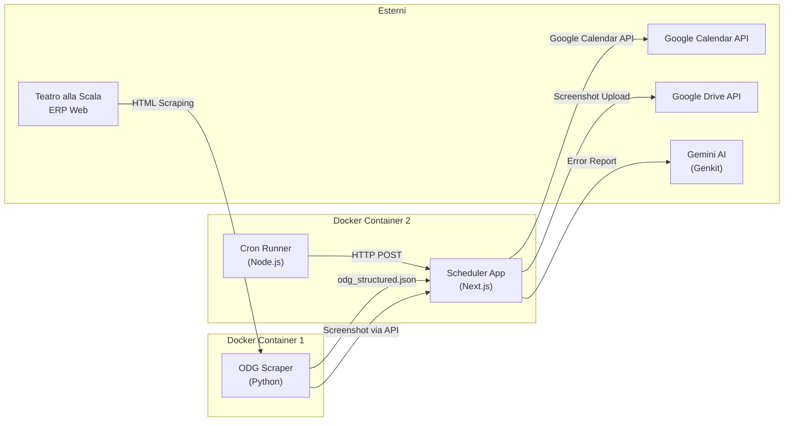
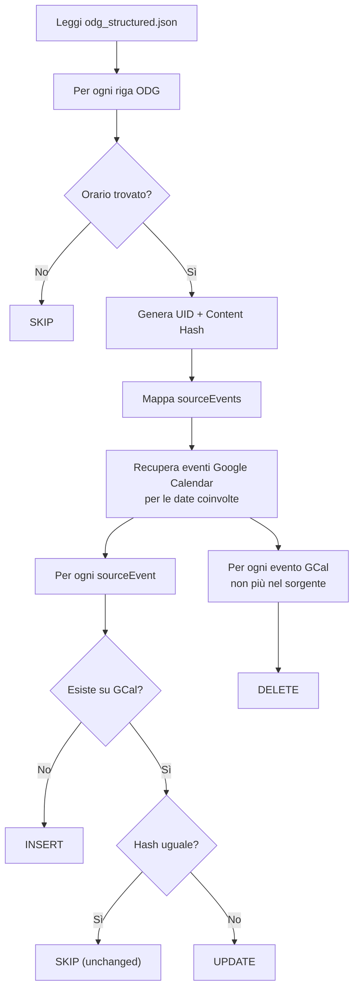
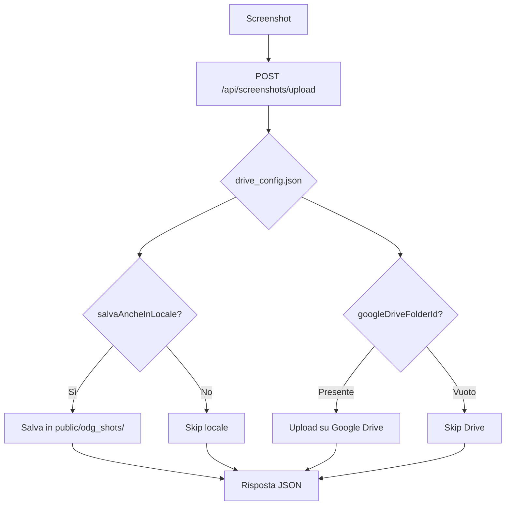

# ScalaScheduler — Analisi Tecnica Completa

> **Progetto**: Chorus Calendar Sync (aka "ScalaScheduler")
> **Autore**: ciacky85 (Carlo)
> **Scopo**: Estrarre gli eventi dai programmi di lavoro del Coro del Teatro alla Scala (PDF e pagine web) e sincronizzarli su calendari Google tramite Service Account. Archiviare screenshot degli ODG su Google Drive.
> **Data analisi**: 01/09/2026
> **Ultimo aggiornamento**: 01/09/2026 — Modulo Autenticazione & Login, Gestione Utenti (Admin), Workflow di Approvazione Registrazioni, Associazione Granulare Utenti-Calendari Google, RBAC Tab Visibility, Interfaccia Unificata Calendari, Ottimizzazione Docker Standalone, Diagnostica Dettagliata Google Drive API

---

## 1. Panoramica Architetturale

Il sistema è composto da **3 sotto-progetti indipendenti** che comunicano tramite file JSON condivisi:



### I 3 Moduli nel Monorepo Unificato

| Modulo | Linguaggio | Ruolo |
|--------|-----------|-------|
| `odg-docker-scraper/` | Python 3.12 | Microservizio scraping periodico autonomo → produce `odg_structured.json` e legge `config.json` |
| `scheduler/` | TypeScript/Next.js 15 | App web principale: parsing PDF, export Google Calendar, gestione Drive, **Autenticazione Multi-Utente con RBAC**, **Pannello Admin ODG Scraper** |
| `docker-compose.yml` | Docker Compose | Orchestrazione unificata di entrambi i container con mappatura volumi Portainer |
| `scheduler_test/` | TypeScript/Next.js | ⚠️ **DEPRECATA** — Versione precedente, da rimuovere. Non è più in uso. |

---

## 2. Modulo: ODG Docker Scraper (`odg-docker-scraper/`)

### 2.1 Tecnologie
- **Python 3.12** (Docker `python:3.12-slim`)
- **Dipendenze**: `requests`, `beautifulsoup4`, `lxml`

### 2.2 File Principali

| File | Funzione |
|------|----------|
| [`main.py`](file:///c:/Users/carlo/Desktop/ProgettiAntiGravity/ScalaScheduler/odg-docker-scraper/main.py) | Script unico: scraping, parsing, gestione note/asterischi, scheduling |
| [`drive_uploader.py`](file:///c:/Users/carlo/Desktop/ProgettiAntiGravity/ScalaScheduler/odg-docker-scraper/drive_uploader.py) | **[NUOVO]** Helper per upload screenshot su Google Drive via API scheduler |
| [`Dockerfile`](file:///c:/Users/carlo/Desktop/ProgettiAntiGravity/ScalaScheduler/odg-docker-scraper/Dockerfile) | Container Python con volume `/data` |
| [`config.json.example`](file:///c:/Users/carlo/Desktop/ProgettiAntiGravity/ScalaScheduler/odg-docker-scraper/config.json.example) | Esempio configurazione |

### 2.3 Funzionamento
1. **Fetch HTML** dalle URL del portale ERP della Scala (`pxf_dspagine_coro.xhtml?pps=0` e `pps=1` — due pagine, una per giorno)
2. **Parsing** della tabella HTML con BeautifulSoup/lxml
3. **Estrazione strutturata** di: data, ultimo aggiornamento, righe con destinatario/luogo/orario/descrizione
4. **Gestione Note a Piè di Pagina (Asterischi)**: rileva note sotto la tabella o nel testo (es. `Note: * 16:15-16:45 Atto Primo - dalle 16:45 Atto Secondo e Terzo`), le ripulisce e le appende deterministicamente (offline, no IA) in coda alla descrizione delle righe contrassegnate da `*` (es. `TRAVIATA * 6° PIANO - 16:15-16:45 Atto Primo - dalle 16:45 Atto Secondo e Terzo`).
5. **Output**: file JSON strutturato in `/data/odg_structured.json`
6. **Scheduling interno**: loop con `time.sleep()`, gestione `SIGINT`/`SIGTERM`. Orari configurabili (default: `07:00`, `21:00`)

### 2.4 Schema Output (`odg_structured.json`)

```json
{
  "export_generated_at": "2025-11-11T00:01:00+01:00",
  "pages": [
    {
      "source_url": "https://erp.teatroallascala.org/...",
      "date": { "label": "Martedì 11 Novembre 2025", "iso": "2025-11-11" },
      "last_update": { "raw": "Agg. 07/11/2025 17:00", "iso": "2025-11-07T17:00+01:00" },
      "table": {
        "columns": [
          { "key": "recipient", "label": "Destinatario" },
          { "key": "place", "label": "Luogo" },
          { "key": "time", "label": "Fascia oraria" },
          { "key": "description", "label": "Descrizione" }
        ],
        "rows": [
          {
            "row_index": 0,
            "recipient": { "raw": "CORO UOMINI", "normalized": "Coro Uomini", "category": "coro" },
            "place": { "raw": "IN SALA", "normalized": "In Sala", "location_type": "sala" },
            "time": { "raw": "14:00 - 15:30", "start": "14:00", "end": "15:30", "tz": "Europe/Rome" },
            "description": {
              "raw": "LADY MACBETH * 6° PIANO...",
              "title": "LADY MACBETH * 6° PIANO",
              "details": ["*ore 14:00 \"LA VOCE DI BORIS\"", "ore 14:30 CORO UOMINI TUTTO"],
              "flags": ["asterisk"]
            },
            "provenance": { "tokens": ["CORO UOMINI", "IN SALA", "14:00 - 15:30", "..."] }
          }
        ]
      },
      "stats": { "row_count": 3 }
    }
  ]
}
```

> [!IMPORTANT]
> Lo schema `odg_structured.json` è il **contratto di interfaccia** tra scraper e scheduler. Ogni modifica allo schema deve essere sincronizzata su entrambi i moduli.

### 2.5 Classificazione Luoghi (Python)
```python
"ansaldo" → "ansaldo"
"sala"    → "sala"
"teatro"  → "teatro"
"ridotto" → "ridotto"
"palco"   → "palco"
"studio"  → "studio"
_         → "altro"
```

---

## 3. Modulo: Scheduler App (`scheduler/`)

### 3.1 Stack Tecnologico

| Tecnologia | Versione | Uso |
|-----------|---------|-----|
| **Next.js** | 15.3.3 | Framework full-stack (App Router) |
| **React** | 18.3.1 | UI |
| **TypeScript** | ^5 | Type safety |
| **TailwindCSS** | ^3.4.1 | Styling |
| **shadcn/ui** | (Radix UI) | Componenti UI |
| **pdfjs-dist** | 4.2.67 | Parsing PDF client-side |
| **googleapis** | 140.0.1 | Google Calendar API |
| **google-auth-library** | 9.11.0 | Auth Service Account |
| **Genkit** | 1.20.0 | AI (Gemini 2.5 Flash) |
| **Framer Motion** | 11.5.7 | Animazioni |
| **date-fns** / **date-fns-tz** | 3.x | Gestione date/timezone |

### 3.2 Struttura Directory (con alias `@/`)

Il progetto usa `src/` come radice mappata all'alias `@/`. I file a root level (`page.tsx`, `layout.tsx`, ecc.) sono duplicati nella cartella `app/` e `src/app/`.

```
scheduler/
├── src/
│   ├── ai/                          # Modulo AI (Genkit)
│   │   ├── genkit.ts                # Configurazione Genkit + Google AI plugin
│   │   ├── dev.ts                   # Dev entry per Genkit CLI
│   │   └── flows/
│   │       └── generate-export-error-report.ts  # Flow AI per report errori
│   ├── app/
│   │   ├── layout.tsx               # Root layout (fonts, providers)
│   │   ├── page.tsx                 # Home page (Login Gate + 5 tabs con RBAC)
│   │   ├── globals.css              # CSS con variabili tema
│   │   ├── config/
│   │   │   ├── calendars.json       # Configurazione calendari Google (con ownerUserId)
│   │   │   ├── user.json            # [NUOVO] Database utenti (password in chiaro)
│   │   │   ├── drive_config.json    # Config Google Drive (URL cartella, salva locale)
│   │   │   ├── odg_update_time.json # Orari schedulazione cron
│   │   │   └── service-account-key.json  # Chiave SA Google (SEGRETO)
│   │   ├── api/
│   │   │   ├── auth/                # [NUOVO] API Autenticazione
│   │   │   │   ├── login/route.ts   # POST: login con password in chiaro
│   │   │   │   ├── logout/route.ts  # POST: logout (clear cookie)
│   │   │   │   ├── me/route.ts      # GET: profilo utente corrente
│   │   │   │   └── register/route.ts # POST: registrazione nuovo utente
│   │   │   ├── admin/               # [NUOVO] API Admin
│   │   │   │   └── users/
│   │   │   │       ├── route.ts     # GET/POST: lista utenti / crea utente
│   │   │   │       └── [id]/route.ts # PUT/DELETE: modifica/elimina utente
│   │   │   ├── calendars/route.ts   # GET/POST: calendari con ownerUserId e ownerName
│   │   │   ├── settings/
│   │   │   │   └── drive/route.ts   # GET/POST: config Google Drive screenshot
│   │   │   ├── screenshots/
│   │   │   │   └── upload/route.ts  # POST: upload screenshot → Drive + locale
│   │   │   ├── scraper/             # API Scraper Manager
│   │   │   │   ├── config/route.ts  # GET/POST: configurazione scraper
│   │   │   │   ├── run/route.ts     # POST: esecuzione on-demand
│   │   │   │   └── status/route.ts  # GET: stato scraper
│   │   │   └── odg/
│   │   │       ├── push/route.ts    # POST: push manuale ODG → Google Calendar
│   │   │       └── cron/route.ts    # POST: push automatico (chiamato dal cron)
│   │   └── components/
│   │       ├── odg-tab.tsx          # Tab "ODG"
│   │       ├── importa-calendario-tab.tsx  # Tab "Importa Calendario"
│   │       ├── impostazioni-tab.tsx # Tab "Impostazioni" (Admin: hub calendari + Drive)
│   │       ├── tabella-calendario.tsx  # Tabella eventi editabile
│   │       ├── export-controls.tsx  # Controlli esportazione (select cal + pulsante)
│   │       ├── admin/               # [NUOVO] Componenti Admin
│   │       │   ├── gestione-utenti-tab.tsx  # Tab "Utenti" (solo gestione account)
│   │       │   └── scraper-manager-tab.tsx  # Tab "Scraper"
│   │       └── importa-calendario/
│   │           └── upload-pdf.tsx   # Upload + trigger parsing PDF
│   ├── components/ui/              # 35 componenti shadcn/ui
│   ├── contexts/
│   │   ├── auth-context.tsx         # [NUOVO] Provider autenticazione + RBAC + isCalendarAllowed
│   │   ├── settings-context.tsx     # Provider impostazioni app
│   │   └── calendar-context.tsx     # Provider gestione calendari
│   ├── hooks/
│   │   ├── use-toast.ts            # Hook toast notifications
│   │   └── use-mobile.tsx          # Hook responsive
│   └── lib/
│       ├── types.ts                # Tipi TypeScript condivisi (+ ownerUserId, UserProfile, UserRole)
│       ├── utils.ts                # cn() per classi CSS
│       ├── constants.ts            # Costanti (TIMEZONE)
│       ├── auth/                    # [NUOVO] Modulo Autenticazione
│       │   └── users-store.ts      # Lettura/scrittura user.json, password in chiaro
│       ├── calendar/
│       │   └── export-events.ts    # Logica esportazione PDF → Google Cal
│       ├── drive/
│       │   └── google-drive.ts     # Integrazione Google Drive (auth, upload, verify, diagnostica dettagliata)
│       ├── pdf/
│       │   └── estraiProgrammaCoro.ts  # Parser PDF (client-side)
│       ├── settings/
│       │   └── store.ts            # Persistenza settings (localStorage) (+ defaults Drive)
│       └── utils/
│           └── date.ts             # Utility date
├── Dockerfile                       # Multi-stage build standalone (deps → build → run) ~180 MB
├── Dockerfile.cron                  # Container Alpine con dcron
├── docker-compose.yml               # Orchestrazione app + cron
├── cron-runner.js                   # Scheduler JS (tick + match orari)
├── run-cron.sh                      # Script shell: POST → /api/odg/cron
├── entrypoint-wrapper.sh            # Entrypoint Docker: avvia cron-runner + next
├── apphosting.yaml                  # Config Firebase App Hosting
└── public/
    ├── odg_structured.json          # Dati ODG (shared con scraper via volume)
    ├── odg_shots/                   # Screenshot salvati in locale (se abilitato)
    └── odg_sync.log                 # Log sincronizzazione
```

### 3.3 Login Gate & Autenticazione — **[NUOVO]**

L'applicazione implementa un **Access Gate obbligatorio**: se l'utente non è autenticato, l'intera interfaccia è bloccata e viene mostrato esclusivamente il modulo di Login / Registrazione centrato a schermo.

**Componenti**:
- **`auth-context.tsx`**: React Context Provider che gestisce lo stato di autenticazione, il profilo utente, le funzioni `login()`, `logout()`, `register()`, e la funzione `isCalendarAllowed(calendarId)` per il filtraggio per-utente.
- **`users-store.ts`**: Modulo server-side per lettura/scrittura del file `user.json` (e fallback `users.json`). Le **password sono gestite e salvate in chiaro** (requisito di progetto).
- **API Routes**: `/api/auth/login`, `/api/auth/logout`, `/api/auth/me`, `/api/auth/register`.
- **Cookie di sessione**: `auth-token` (cookie HTTP-only) contenente l'ID utente.

**Flusso Login**:
1. Utente inserisce username e password.
2. POST `/api/auth/login` → verifica `inputPassword.trim() === user.password.trim()` (chiaro).
3. Se OK → set cookie `auth-token` e redirect alla home.
4. Se KO → messaggio "Credenziali non valide".

**Flusso Registrazione**:
1. Utente compila nome, email, password.
2. POST `/api/auth/register` → crea record con `status: 'pending'`.
3. L'admin vede la richiesta nella scheda "Utenti" e può approvarla/rifiutarla.

### 3.4 L'Interfaccia Web — 5 Tab con RBAC

> **Visibilità Tab per Ruolo:**
> | Tab | Admin | Corista |
> |-----|:-----:|:-------:|
> | Importa Calendario | ✅ | ✅ (solo proprio calendario) |
> | ODG | ✅ | ✅ |
> | Impostazioni | ✅ | ❌ |
> | Scraper | ✅ | ❌ |
> | Utenti | ✅ | ❌ |

#### Tab 1: "Importa Calendario" (Parsing PDF) — Visibile a tutti
**Flusso**:
1. L'utente carica un file PDF (programma quindicinale prove del coro)
2. [`estraiProgrammaCoro.ts`](file:///c:/Users/carlo/Desktop/ProgettiAntiGravity/ScalaScheduler/scheduler/src/lib/pdf/estraiProgrammaCoro.ts) esegue il parsing **client-side** con `pdfjs-dist`
3. Il parser:
   - Ricostruisce le righe di testo raggruppando gli item per coordinata Y
   - Identifica mese/anno dall'intestazione
   - Rileva le note a piè di pagina (linee con `*`)
   - Itera le righe cercando pattern `<giorno> <data>` come intestazioni giornaliere
   - Estrae orari con regex (supporta `HH:mm`, `HH.mm`, range con `-`, `–`, `—`)
   - Deduce luoghi da keyword (`PALCOSCENICO`, `SALA PROVE`, `RIDOTTO`, `ANSALDO`, etc.)
   - Gestisce asterischi concatenando il significato dal piè di pagina (de-dup)
   - Gestisce stati `ok` / `da_revisionare` (date non riconosciute)
4. Viene mostrata una **tabella editabile** ([`tabella-calendario.tsx`](file:///c:/Users/carlo/Desktop/ProgettiAntiGravity/ScalaScheduler/scheduler/src/app/components/tabella-calendario.tsx)):
   - Checkbox per selezione/deselezione
   - Campi editabili: descrizione, luogo, fasce orarie (1 e 2), data (con date picker)
   - Filtro testuale, ordinamento, selezione multipla
   - Badge "Da Revisionare" per righe problematiche
5. **Filtraggio per proprietario**: un utente Corista vede nel dropdown solo i calendari di cui è proprietario (`ownerUserId === user.id`). Gli admin vedono tutti.
6. Pulsante "Esporta su Google Calendar" → [`export-events.ts`](file:///c:/Users/carlo/Desktop/ProgettiAntiGravity/ScalaScheduler/scheduler/src/lib/calendar/export-events.ts) (Server Action)

#### Tab 2: "ODG" (Ordine del Giorno da Web) — Visibile a tutti
**Flusso**:
1. Carica `/odg_structured.json` (via fetch, prodotto dallo scraper)
2. Mostra tabella **read-only** con data/destinatario/luogo/orario/descrizione
3. Selezionare calendario di destinazione (filtrato per proprietario) e push tramite API `/api/odg/push`
4. Supporta **Dry Run** (simulazione senza modifiche)
5. Mostra risultato sync: scanned/inserted/updated/unchanged/deleted/skipped

#### Tab 3: "Impostazioni" (Solo Admin)
- **Service Account**: mostra email del service account da aggiungere con permessi di scrittura a Google Calendar e con ruolo **Editor** alla cartella di Google Drive.
- **Hub Unico Gestione Calendari**: tabella centralizzata per TUTTI i calendari con:
  - CRUD completo (aggiunta, modifica, eliminazione)
  - Campi: etichetta, calendarId, tipo (importaCalendario/odg), predefinito
  - **Assegnazione Proprietario (`ownerUserId`)**: menu a tendina con tutti gli utenti registrati per associare ogni calendario al suo corista proprietario
  - Badge con nome proprietario nella colonna dedicata
- **Salvataggio Screenshot su Google Drive**:
  - Input link/ID cartella Google Drive per gli screenshot
  - Toggle switch "Salva anche in locale"
  - Pulsante per testare la connessione con **diagnostica errori dettagliata** (mostra il messaggio originale dell'API Google, con suggerimento di abilitare la Google Drive API se necessario)
  - Configurazione persistita in `config/drive_config.json`

#### Tab 4: "Scraper" (Solo Admin)
- **Dashboard Stato**: mostra data/ora ultimo scraping, pagine analizzate, righe totali e dettaglio per data.
- **Esecuzione Manuale On-Demand**: pulsante "Esegui Scraper Adesso" per forzare il refresh immediato dei dati senza attendere il cron.
- **Configurazione URL Pagine ERP**: interfaccia per visualizzare, aggiungere, rimuovere e modificare le URL target.
- **Configurazione Schedulazioni (`schedules`)**: gestione degli orari di scansione (es. `07:00`, `21:00`).
- **Opzione `run_on_start`**: toggle per scansione immediata all'avvio del container.
- **Persistenza**: salva direttamente in `config.json` sul volume condiviso Portainer `/srv/docker_conf/configs/ScalaScheduler/odg-scraper/config`.

#### Tab 5: "Utenti" (Solo Admin)
- **Richieste in attesa**: sezione dedicata con pulsanti Approva/Rifiuta per le registrazioni pendenti.
- **Elenco utenti**: tabella con nome, username, email, ruolo (Admin/Corista), stato account.
- **Modifica utente**: popup con form pulito per aggiornare Nome, Username, Email, Password, Ruolo e Stato. **Nessuna gestione calendari** in questa scheda (centralizzata in Impostazioni).
- **Creazione manuale**: pulsante per creare un account direttamente con status "approvato".
- **Eliminazione**: pulsante per rimuovere un account.

### 3.5 Tipi TypeScript Principali

```typescript
// lib/types.ts
interface RigaCalendario {
  id: string;           // UUID
  selected: boolean;    // checkbox
  giornoSettimanale: string;  // "Lunedì" ...
  data: string;         // "dd/MM/yyyy"
  descrizione: string;
  dettaglio: string;
  luogo: string;
  fascia1Start?: string;  // "HH:mm"
  fascia1End?: string;
  fascia2Start?: string;
  fascia2End?: string;
  stato?: 'ok' | 'da_revisionare';
  rawText?: string;
}

interface ImpostazioniCalendario {
  id: string;
  label: string;
  calendarId: string;       // ID Google Calendar
  tipo: 'importaCalendario' | 'odg';
  predefinito?: boolean;
  ownerUserId?: string;     // [NUOVO] UUID del proprietario (da user.json)
}

// [NUOVO] Profilo utente (persistito in user.json)
type UserRole = 'admin' | 'user';
type UserStatus = 'approved' | 'pending' | 'disabled' | 'rejected';

interface UserProfile {
  id: string;                     // UUID v4
  username: string;               // Email di accesso
  nome: string;                   // Nome e Cognome
  email: string;
  password: string;               // Password in CHIARO (requisito di progetto)
  role: UserRole;                 // 'admin' | 'user'
  status: UserStatus;             // 'approved' | 'pending' | 'disabled' | 'rejected'
  assignedCalendarIds: string[];  // Array di calendarId Google associati
  createdAt: string;              // ISO-8601
  approvedAt?: string;            // ISO-8601 (quando approvato dall'admin)
}

interface AppSettings {
  calendari: ImpostazioniCalendario[];
  durataDefaultMin: number;
  timezone: 'Europe/Rome';
  consentiDateFuoriMese: boolean;
  exportMode: 'oauth' | 'serviceAccount';
  googleDriveFolderUrl?: string;
  salvaAncheInLocale?: boolean;
}

// Configurazione persistita server-side (drive_config.json)
interface DriveConfig {
  googleDriveFolderUrl: string;   // URL o ID inserito dall'utente
  googleDriveFolderId: string;    // ID estratto automaticamente
  salvaAncheInLocale: boolean;    // Flag salvataggio locale
}
```

### 3.6 API Routes (Server-Side)

#### `POST /api/calendars`
- **File**: [`api/calendars/route.ts`](file:///c:/Users/carlo/Desktop/ProgettiAntiGravity/ScalaScheduler/scheduler/api/calendars/route.ts)
- **Funzione**: Salva la configurazione dei calendari su file (`src/app/config/calendars.json`)
- **Input**: `ImpostazioniCalendario[]`
- **Output**: `{ ok: true }` / `{ ok: false, error: string }`

#### `POST /api/odg/push`
- **File**: [`route.ts`](file:///c:/Users/carlo/Desktop/ProgettiAntiGravity/ScalaScheduler/scheduler/route.ts) (root, duplicato in `push/`)
- **Funzione**: Push manuale ODG → Google Calendar
- **Input**: `{ calendarId: string, dryRun?: boolean }`
- **Logica di sync**:
  1. Legge `odg_structured.json`
  2. Per ogni riga, ricerca orari con fallback su 8 livelli (strutturato → raw → descrizione → title → details → concatenato → provenance → raw_line)
  3. Genera UID univoco per evento: `odg|<data>|<start>|<end>|<desc>|<recipient>|<place>`
  4. Genera content hash SHA1 per confronto
  5. Recupera eventi esistenti dal calendario Google per le date coinvolte
  6. Esegue upsert intelligente: insert/update/skip/delete
  7. Rimuove duplicati e eventi non più presenti nel sorgente

#### `POST /api/odg/cron`
- **File**: [`cron/route.ts`](file:///c:/Users/carlo/Desktop/ProgettiAntiGravity/ScalaScheduler/scheduler/cron/route.ts)
- **Funzione**: Identica a `/api/odg/push` ma chiamata dal cron scheduler
- **Differenze**: legge automaticamente il `calendarId` predefinito da `calendars.json`, non supporta dry run

#### `GET/POST /api/settings/drive` — **[NUOVO]**
- **File**: [`api/settings/drive/route.ts`](file:///c:/Users/carlo/Desktop/ProgettiAntiGravity/ScalaScheduler/scheduler/src/app/api/settings/drive/route.ts)
- **GET**: Legge la configurazione Drive corrente da `drive_config.json`
- **POST**: Salva la configurazione e opzionalmente verifica l'accesso alla cartella
- **Input POST**: `{ googleDriveFolderUrl: string, salvaAncheInLocale: boolean, testConnection?: boolean }`
- **Output POST**: `{ ok, config: DriveConfig, testResult?: { ok, folderName?, error? } }`

#### `POST /api/screenshots/upload` — **[NUOVO]**
- **File**: [`api/screenshots/upload/route.ts`](file:///c:/Users/carlo/Desktop/ProgettiAntiGravity/ScalaScheduler/scheduler/src/app/api/screenshots/upload/route.ts)
- **Funzione**: Riceve uno screenshot (FormData con `file` e `filename`), lo salva su Google Drive e opzionalmente in locale
- **Logica**:
  1. Se `salvaAncheInLocale = true` → salva in `public/odg_shots/`
  2. Se `googleDriveFolderId` configurato → upload su Google Drive via Service Account
- **Output**: `{ ok, fileName, savedLocally, localPath?, driveResult: { ok, fileId?, webViewLink?, error? } }`

#### `GET/POST /api/scraper/config` — **[NUOVO]**
- **File**: [`api/scraper/config/route.ts`](file:///c:/Users/carlo/Desktop/ProgettiAntiGravity/ScalaScheduler/scheduler/src/app/api/scraper/config/route.ts)
- **Funzione**: Lettura e salvataggio delle impostazioni dello scraper (URLs, orari schedules, run_on_start) in `config.json`

#### `GET /api/scraper/status` — **[NUOVO]**
- **File**: [`api/scraper/status/route.ts`](file:///c:/Users/carlo/Desktop/ProgettiAntiGravity/ScalaScheduler/scheduler/src/app/api/scraper/status/route.ts)
- **Funzione**: Restituisce le statistiche e l'ultimo stato di `odg_structured.json` e dei file di configurazione

#### `POST /api/scraper/run` — **[NUOVO]**
- **File**: [`api/scraper/run/route.ts`](file:///c:/Users/carlo/Desktop/ProgettiAntiGravity/ScalaScheduler/scheduler/src/app/api/scraper/run/route.ts)
- **Funzione**: Esegue lo scraping on-demand in tempo reale e rigenera `odg_structured.json` istantaneamente

#### `GET/POST /api/admin/users` — **[NUOVO]**
- **File**: [`api/admin/users/route.ts`](file:///c:/Users/carlo/Desktop/ProgettiAntiGravity/ScalaScheduler/scheduler/src/app/api/admin/users/route.ts)
- **GET**: Restituisce tutti gli utenti registrati
- **POST**: Crea un nuovo utente manualmente (con status "approved")

#### `PUT/DELETE /api/admin/users/[id]` — **[NUOVO]**
- **File**: [`api/admin/users/[id]/route.ts`](file:///c:/Users/carlo/Desktop/ProgettiAntiGravity/ScalaScheduler/scheduler/src/app/api/admin/users/%5Bid%5D/route.ts)
- **PUT**: Aggiorna ruolo, stato, nome, email, password di un utente. Supporta azioni speciali `approve` e `reject`.
- **DELETE**: Elimina un utente dal sistema.

#### `POST /api/auth/login` — **[NUOVO]**
- **Funzione**: Verifica credenziali (password in chiaro) e imposta cookie `auth-token`

#### `POST /api/auth/register` — **[NUOVO]**
- **Funzione**: Crea utente con `status: 'pending'`, richiede approvazione admin

#### `GET /api/auth/me` — **[NUOVO]**
- **Funzione**: Restituisce profilo utente basato sul cookie di sessione

### 3.7 Logica di Sincronizzazione Google Calendar (Dettaglio)

La funzione `runSync()` implementa un pattern di **idempotent sync** con queste fasi:



**Extended Properties** salvate su ogni evento Google:
```
odg_uid, odg_content_hash, odg_date_iso,
odg_last_update_raw, odg_last_update_iso,
odg_source_url, odg_export_generated_at
```

### 3.8 Parser PDF — Dettaglio Tecnico

Il file [`estraiProgrammaCoro.ts`](file:///c:/Users/carlo/Desktop/ProgettiAntiGravity/ScalaScheduler/scheduler/lib/pdf/estraiProgrammaCoro.ts) è il cuore del parsing dei programmi PDF quindicinali:

**Pipeline**:
1. `pdfjs-dist` → estrazione `TextContent.items` con coordinate `[x, y]`
2. `buildLines()` → raggruppamento per riga (Y tolerance = 2px), ordinamento celle per X
3. Filtra righe di header/intro (regex patterns: "fondazione di diritto privato", "programma quindicinale", ecc.)
4. Estrae "Aggiornato il DD/MM/YYYY"
5. Identifica mese/anno dal testo
6. Estrae note a piè di pagina (righe `* ...`), split/dedup
7. Itera cercando pattern `<giorno_settimana> <numero_giorno>`:
   - Ogni match apre un nuovo "blocco giorno"
   - Le righe successive vengono accumulate in un buffer
   - Al flush: estrazione orari, luoghi, gestione asterischi
8. **Gestione orari**: regex `(\d{1,2}[.:]\d{2})`, supporta fino a 4 match → 2 fasce
9. **Gestione asterischi**: se il testo contiene `*`, appende il significato della nota senza duplicati
10. Ordinamento finale per data+orario

### 3.9 Esportazione PDF → Google Calendar

[`export-events.ts`](file:///c:/Users/carlo/Desktop/ProgettiAntiGravity/ScalaScheduler/scheduler/lib/calendar/export-events.ts) (Server Action `'use server'`):

- Itera sulle `RigaCalendario` selezionate
- **Senza orari**: crea evento "all-day"
- **Con orari**: crea eventi per fascia1 e/o fascia2
- **Senza orario di fine**: calcola fine = start + `durataDefaultMin` minuti
- Autenticazione: JWT Service Account (`google-auth-library`)
- **Error handling**: accumula errori, poi invoca Genkit per generare report leggibile

### 3.10 Modulo AI (Genkit)

- **Configurazione**: [`ai/genkit.ts`](file:///c:/Users/carlo/Desktop/ProgettiAntiGravity/ScalaScheduler/scheduler/ai/genkit.ts)
  - Plugin: `@genkit-ai/google-genai`
  - Modello: `googleai/gemini-2.5-flash`
  - API Key: variabile d'ambiente `GEMINI_API_KEY`
- **Flow**: [`generate-export-error-report.ts`](file:///c:/Users/carlo/Desktop/ProgettiAntiGravity/ScalaScheduler/scheduler/ai/flows/generate-export-error-report.ts)
  - Input: `string[]` (lista errori)
  - Output: `string` (report leggibile)
  - Prompt: chiede all'AI di riassumere gli errori e suggerire soluzioni

### 3.11 Integrazione Google Drive

Modulo [`lib/drive/google-drive.ts`](file:///c:/Users/carlo/Desktop/ProgettiAntiGravity/ScalaScheduler/scheduler/src/lib/drive/google-drive.ts) — gestisce l'intero ciclo di vita degli screenshot su Google Drive:

| Funzione | Descrizione |
|----------|-------------|
| `extractDriveFolderId(urlOrId)` | Estrae l'ID cartella da qualsiasi formato URL di Google Drive |
| `createDriveAuth()` | Crea client JWT con scope Drive usando `service-account-key.json` |
| `getDriveConfig()` | Legge `drive_config.json` con fallback a defaults |
| `saveDriveConfig(config)` | Persiste la configurazione su file JSON |
| `verifyDriveFolderAccess(folderId)` | Verifica che il SA abbia accesso alla cartella. **Diagnostica dettagliata**: include `includeItemsFromAllDrives: true`, `supportsAllDrives: true` e mostra il messaggio di errore originale dell'API Google (es. "Google Drive API has not been used in project...") per errori 403/404 |
| `uploadScreenshotToDrive(buffer, fileName, mimeType)` | Upload file nella cartella configurata via Google Drive API v3 |

**Scope Google Drive richiesti**:
```
https://www.googleapis.com/auth/drive
https://www.googleapis.com/auth/drive.file
```

**Formati URL supportati** per il campo cartella:
- `https://drive.google.com/drive/folders/1aBcD_efGhIjKlMnOpQrStUvWxYz`
- `https://drive.google.com/drive/u/0/folders/1aBcD_efGhIjKlMnOpQrStUvWxYz`
- `https://drive.google.com/open?id=1aBcD_efGhIjKlMnOpQrStUvWxYz`
- `1aBcD_efGhIjKlMnOpQrStUvWxYz` (ID diretto)

### 3.12 Gestione Stato Applicazione

| Store | Tecnologia | Dati |
|-------|-----------|------|
| Settings | `localStorage` (browser) | `durataDefaultMin`, `timezone`, `consentiDateFuoriMese`, `exportMode`, `googleDriveFolderUrl`, `salvaAncheInLocale` |
| Calendari | File JSON (`config/calendars.json`) via API | Lista calendari con label, ID Google, tipo, predefinito, **ownerUserId** |
| **Utenti** | **File JSON (`config/user.json`) via API** | **[NUOVO] Profili utenti con password in chiaro, ruoli, stato, calendari assegnati** |
| **Drive Config** | **File JSON (`src/app/config/drive_config.json`) via API** | **[NUOVO] URL cartella, ID estratto, flag salva-locale** |
| ODG Data | File JSON (`public/odg_structured.json`) | Dati scraper (read-only dalla web app) |
| ODG Orari Cron | File JSON (`config/odg_update_time.json`) | Orari di esecuzione cron |
| PDF Parsed Data | State React (in memoria) | Dati estratti dal PDF (non persistiti) |

### 3.13 Configurazione Calendari

File [`calendars.json`](file:///c:/Users/carlo/Desktop/ProgettiAntiGravity/ScalaScheduler/scheduler/calendars.json):
```json
{
  "importaCalendario": [
    {
      "id": "cal-import-default-1",
      "label": "Tenori_test",
      "calendarId": "98421e11d...@group.calendar.google.com",
      "tipo": "importaCalendario",
      "predefinito": true
    }
  ],
  "odg": [
    {
      "id": "cal-odg-default-1",
      "label": "ODG - TEST",
      "calendarId": "42f8d099...@group.calendar.google.com",
      "tipo": "odg",
      "predefinito": true
    }
  ]
}
```

### 3.14 Configurazione Google Drive

File `src/app/config/drive_config.json` (creato automaticamente al primo salvataggio):
```json
{
  "googleDriveFolderUrl": "https://drive.google.com/drive/folders/1aBcD...",
  "googleDriveFolderId": "1aBcD...",
  "salvaAncheInLocale": true
}
```

---

## 4. Infrastruttura Docker

### 4.1 Docker Compose (Portainer)

```yaml
services:
  scala-scheduler:
    build:
      context: ./scheduler
      dockerfile: Dockerfile
    container_name: ScalaScheduler
    restart: always
    ports:
      - "3010:3000"
    environment:
      - TZ=Europe/Rome
      - NODE_ENV=production
    volumes:
      - /srv/docker_conf/configs/ScalaScheduler/config:/app/config
      - /srv/docker_conf/configs/ScalaScheduler/config:/app/src/app/config
      - /srv/docker_conf/configs/ScalaScheduler/odg-scraper/config:/app/public
    depends_on:
      - odg-scraper

  odg-scraper:
    build:
      context: ./odg-docker-scraper
      dockerfile: Dockerfile
    container_name: odg-scraper
    restart: always
    environment:
      - TZ=Europe/Rome
    volumes:
      - /srv/docker_conf/configs/ScalaScheduler/odg-scraper/config:/data
```

### 4.2 Ottimizzazione Dockerfile (Standalone Build) — **[AGGIORNATO]**

Il Dockerfile del scheduler usa un **build multi-stage con output `standalone`** per ridurre drasticamente le dimensioni dell'immagine:
- **Prima**: ~1.5 GB (con tutti i `node_modules` e le dev dependencies)
- **Dopo**: ~180 MB (riduzione dell'88%)
- Il file `next.config.ts` include `output: 'standalone'` che produce un server autonomo minimale.
- La fase finale del Dockerfile copia solo il server standalone, i file statici e le risorse pubbliche.
- `npm cache clean --force` e rimozione di `.next/cache` per ulteriore risparmio.

### 4.3 Meccanismo Cron (Doppia Implementazione)

Ci sono **due sistemi cron** coesistenti:

**1. `cron-runner.js`** (integrato nel container app):
- Avviato come processo background dall'`entrypoint-wrapper.sh`
- Polling ogni 15 secondi
- Legge gli orari da `odg_update_time.json`
- Quando l'ora corrente matcha un orario configurato, esegue `run-cron.sh`

**2. `Dockerfile.cron`** (container separato con Alpine + dcron):
- Esegue `run-cron.sh` ogni minuto
- Script: POST HTTP a `http://localhost:3000/api/odg/cron`

`run-cron.sh`:
```bash
API_ENDPOINT="${API_ENDPOINT:-http://localhost:3000/api/odg/cron}"
curl -sS -X POST -H "Content-Type: application/json" "$API_ENDPOINT" --fail
# 3 tentativi con retry
```

### 4.4 Orari Aggiornamento Configurati
```json
{ "timezone": "Europe/Rome", "update_times": ["00:05", "08:05", "12:25", "21:05"] }
```

### 4.5 Container Registry
- Docker Hub: `ciacky85/classroom-scheduler`
- GHCR: `ghcr.io/ciacky85/classroom-scheduler`

---

## 5. Autenticazione e Sicurezza

### 5.1 Google Service Account
- **Email**: `calendar-scheduler@sturdy-yen-458414-h7.iam.gserviceaccount.com`
- **Scope Calendar**: `https://www.googleapis.com/auth/calendar`
- **Scope Drive**: `https://www.googleapis.com/auth/drive`, `https://www.googleapis.com/auth/drive.file`
- **File chiave**: `service-account-key.json` (nel `.gitignore`)
- **Requisiti**:
  - L'email del SA deve essere invitata come **Editor** nei calendari Google di destinazione
  - L'email del SA deve essere invitata come **Editor** nella cartella Google Drive per gli screenshot
  - La **Google Drive API** deve essere **abilitata** nel progetto Google Cloud (`sturdy-yen-458414-h7`). Senza questa abilitazione si riceve errore 403.

### 5.2 Autenticazione Web — **[NUOVO]**
- **Tipo**: Cookie-based session (`auth-token`)
- **Password**: gestite e verificate **in chiaro** (`inputPassword.trim() === user.password.trim()`)
- **File persistenza utenti**: `config/user.json` (array di `UserProfile`)
- **Ruoli**: `admin` (accesso completo), `user` (solo Importa Calendario e ODG)
- **Workflow registrazione**: utente si registra → stato `pending` → admin approva/rifiuta dalla tab "Utenti"
- **Associazione calendario**: ogni calendario in `calendars.json` ha un campo `ownerUserId` che corrisponde all'`id` dell'utente in `user.json`. La funzione `isCalendarAllowed()` in `auth-context.tsx` verifica `cal.ownerUserId === user.id`.

### 5.3 Gemini API Key
- Variabile d'ambiente: `GEMINI_API_KEY`
- Usata per il flow AI di generazione report errori

> [!CAUTION]
> Il file `Docker Istruzioni.txt` contiene in chiaro una password DockerHub e un token PAT. Dovrebbe essere rimosso dalla repo e le credenziali dovrebbero essere ruotate.

> [!WARNING]
> Il file `.env` contiene la `GEMINI_API_KEY` in chiaro ed è presente in entrambe le copie (`scheduler/` e `scheduler_test/`). Non è nel `.gitignore`.

---

## 6. Criticità e Debito Tecnico

### 6.1 Duplicazione Massiva di Codice

> [!CAUTION]
> **Problema critico**: la logica di sincronizzazione ODG → Google Calendar è **duplicata 3 volte** in file quasi identici:
> 1. [`scheduler/route.ts`](file:///c:/Users/carlo/Desktop/ProgettiAntiGravity/ScalaScheduler/scheduler/route.ts) (root)
> 2. [`scheduler/cron/route.ts`](file:///c:/Users/carlo/Desktop/ProgettiAntiGravity/ScalaScheduler/scheduler/cron/route.ts)
> 3. Probabilmente anche in `app/api/odg/push/route.ts` e `app/api/odg/cron/route.ts`
>
> Le funzioni `getEventTimes()`, `generateEventUid()`, `generateContentHash()`, `runSync()` sono copiate identiche con lievi variazioni.

**Rimedio suggerito**: estrarre la logica comune in `lib/odg/sync.ts` e importarla in entrambe le route.

### 6.2 `scheduler_test/` — ⚠️ DEPRECATA, DA RIMUOVERE
- Contiene gli stessi file di `scheduler/` con variazioni minime
- `package.json` ha dipendenze diverse (manca `genkit`, `ai` module, `framer-motion`)
- `next.config.js` vs `next.config.ts`
- **Confermato dall'autore**: è una versione precedente che va rimossa dal repository

### 6.3 Struttura File Non Canonica Next.js
- I file `page.tsx`, `layout.tsx`, `globals.css`, `route.ts` sono presenti sia alla **root** di `scheduler/` che dentro `src/app/` e `app/`
- Questa duplicazione genera confusione su quale sia la versione effettivamente servita da Next.js
- I componenti sono duplicati tra `components/` (root) e `app/components/`

### 6.4 Gestione Stato Ibrida
- **Settings**: `localStorage` (browser) — non persistente tra device
- **Calendari**: file JSON su filesystem (via API) — fragile in ambiente serverless
- **Nessun database** — tutto basato su file

### 6.5 Cron Runner come File Heredoc
- [`cron-runner.js`](file:///c:/Users/carlo/Desktop/ProgettiAntiGravity/ScalaScheduler/scheduler/cron-runner.js) inizia con `cat > /app/cron-runner.js <<'JS'`
- Sembra essere stato concepito come parte di uno script shell ma salvato come `.js`
- In Docker, l'`entrypoint-wrapper.sh` lo esegue direttamente con `node`

### 6.6 Nessun Test Automatizzato
- Non ci sono file di test (`*.test.ts`, `*.spec.ts`)
- Nessuna configurazione Jest/Vitest

### 6.7 ~~Nessuna Autenticazione Web~~ ✅ RISOLTO
- ~~L'interfaccia web è accessibile senza login~~
- ~~Chiunque acceda alla porta 3000 può modificare calendari e pushare eventi~~
- **Implementato** Login Gate obbligatorio, gestione utenti con approvazione, RBAC (Admin/Corista) e associazione utente-calendario.

---

## 7. Flussi Dati Completi

### 7.1 Flusso "PDF → Google Calendar" (Manuale)

```
Utente → [Upload PDF] → pdfjs-dist (client) → estraiProgrammaCoro()
    → RigaCalendario[] → [Tabella editabile] → [Selezione eventi]
    → [Click "Esporta"] → exportEventsToGoogleCalendar() (server action)
    → googleapis.calendar.events.insert() → Google Calendar
    → (errori?) → Genkit Gemini AI → Report errori → Utente
```

### 7.2 Flusso "ODG Web → Google Calendar" (Manuale + Automatico)

```
[Scraper Python] → /data/odg_structured.json ← [Volume Docker condiviso]
    → (Manuale) Utente apre Tab ODG → fetch /odg_structured.json
    → [Click "Push su Google Calendar"] → POST /api/odg/push
    → runSync() → Google Calendar API (upsert + delete)

    → (Automatico) cron-runner.js → match orario
    → run-cron.sh → POST /api/odg/cron
    → runSync() → Google Calendar API (upsert + delete)
```

### 7.3 Flusso "Screenshot → Google Drive + Locale" — **[NUOVO]**

```
[Sorgente screenshot] → POST /api/screenshots/upload (FormData: file, filename)
    → API route legge drive_config.json
    → Se salvaAncheInLocale = true → salva in public/odg_shots/
    → Se googleDriveFolderId presente → uploadScreenshotToDrive()
        → JWT Auth (service-account-key.json) → Google Drive API v3
        → files.create() nella cartella configurata
    → Risposta: { localPath, driveResult: { fileId, webViewLink } }
```



---

## 8. Dipendenze Esterne

| Servizio | Tipo | Dettagli |
|----------|------|----------|
| Teatro alla Scala ERP | Web scraping | `erp.teatroallascala.org` (pubblico, no auth) |
| Google Calendar API v3 | REST API | Via Service Account JWT |
| **Google Drive API v3** | **REST API** | **[NUOVO] Via Service Account JWT — upload screenshot in cartella condivisa** |
| Google Gemini 2.5 Flash | AI API | Via Genkit + API Key |
| Docker Hub / GHCR | Container Registry | Deploy immagini |
| Firebase App Hosting | Hosting (non usato) | `apphosting.yaml` presente ma non attivo — il deploy avviene via Docker Compose su server locale/NAS |

---

## 9. Configurazione Necessaria per Sviluppo Locale

### 9.1 Prerequisiti
- Node.js 20+
- Docker & Docker Compose
- Python 3.12+ (per lo scraper, opzionale se si usa Docker)

### 9.2 Setup Scheduler
```bash
cd scheduler
npm install
# Creare/copiare service-account-key.json in src/app/config/
# Creare .env con GEMINI_API_KEY=...
npm run dev  # Avvia su porta 9002 (con Turbopack)
```

### 9.3 Setup Scraper
```bash
cd odg-docker-scraper
docker build -t odg-scraper:2.3 .
mkdir -p data && cp config.json.example data/config.json
docker run -d -e TZ=Europe/Rome -v "$PWD/data:/data" odg-scraper:2.3
```

### 9.4 Setup Completo (Docker Compose)
```bash
cd scheduler
docker-compose up --build
```

---

## 10. Mappa Completa dei File con Funzione

### Root
| File | Funzione |
|------|----------|
| `.gitignore` | Ignora `service-account-key.json`, `Docker Istruzioni.txt` |
| `info.txt` | Note su volumi Docker da mappare |
| `Docker Istruzioni.txt` | Comandi build/push Docker (⚠️ contiene credenziali) |

### `odg-docker-scraper/`
| File | Funzione |
|------|----------|
| `main.py` | Scraper Python: fetch HTML → parse tabella → gestione note/asterischi → JSON |
| `drive_uploader.py` | **[NUOVO]** Helper Python: upload screenshot via API scheduler → Google Drive |
| `Dockerfile` | Container Python 3.12 |
| `requirements.txt` | `requests`, `beautifulsoup4`, `lxml` |
| `config.json.example` | Template configurazione scraper |

### `scheduler/` — Sorgenti Principali
| File | Funzione |
|------|----------|
| `src/app/page.tsx` | Home page: Login Gate + 5 tab con RBAC (Admin/Corista) |
| `src/app/layout.tsx` | Layout: fonts (Inter, Space Grotesk, Source Code Pro), AuthProvider, SettingsProvider |
| `src/lib/types.ts` | Tipi condivisi: `RigaCalendario`, `AppSettings`, `ImpostazioniCalendario` (+ownerUserId), `UserProfile`, `UserRole`, `UserStatus`, `DriveConfig` |
| `src/lib/auth/users-store.ts` | **[NUOVO]** Lettura/scrittura user.json, password in chiaro |
| `src/lib/pdf/estraiProgrammaCoro.ts` | Parser PDF client-side (310 righe) |
| `src/lib/calendar/export-events.ts` | Server action: export righe → Google Calendar |
| `src/lib/drive/google-drive.ts` | Integrazione Google Drive: auth JWT, upload, verify, diagnostica dettagliata errori API |
| `src/lib/settings/store.ts` | Persistenza settings (localStorage) (+defaults Drive) |
| `src/contexts/auth-context.tsx` | **[NUOVO]** Provider autenticazione + RBAC + `isCalendarAllowed()` |
| `src/contexts/settings-context.tsx` | React context: impostazioni app |
| `src/contexts/calendar-context.tsx` | React context: CRUD calendari (save via API) |
| `src/app/components/admin/gestione-utenti-tab.tsx` | **[NUOVO]** Tab Utenti: approvazione, ruolo, stato, password (no calendari) |
| `src/app/components/admin/scraper-manager-tab.tsx` | **[NUOVO]** Tab Scraper: dashboard stato, config, esecuzione on-demand |
| `src/app/api/auth/login/route.ts` | **[NUOVO]** API POST: login con password in chiaro |
| `src/app/api/auth/register/route.ts` | **[NUOVO]** API POST: registrazione utente (status pending) |
| `src/app/api/auth/me/route.ts` | **[NUOVO]** API GET: profilo utente da cookie |
| `src/app/api/auth/logout/route.ts` | **[NUOVO]** API POST: logout (clear cookie) |
| `src/app/api/admin/users/route.ts` | **[NUOVO]** API GET/POST: lista/creazione utenti |
| `src/app/api/admin/users/[id]/route.ts` | **[NUOVO]** API PUT/DELETE: modifica/elimina utente |
| `src/app/api/calendars/route.ts` | API GET/POST: calendari con ownerUserId e risoluzione ownerName |
| `src/app/api/odg/push/route.ts` | API POST: push manuale ODG → Google Cal |
| `src/app/api/odg/cron/route.ts` | API POST: push automatico ODG → Google Cal |
| `src/app/api/settings/drive/route.ts` | API GET/POST: config Google Drive screenshot |
| `src/app/api/screenshots/upload/route.ts` | API POST: upload screenshot → Drive + locale |
| `src/app/config/drive_config.json` | Config persistita Google Drive |
| `src/app/config/user.json` | **[NUOVO]** Database utenti (password in chiaro) |
| `src/ai/genkit.ts` | Config Genkit (Gemini 2.5 Flash) |
| `src/ai/flows/generate-export-error-report.ts` | Flow AI per report errori |

### `scheduler/` — Infrastruttura
| File | Funzione |
|------|----------|
| `Dockerfile` | Multi-stage standalone build (deps → build → run) ~180 MB |
| `Dockerfile.cron` | Alpine + dcron (esegue run-cron.sh ogni minuto) |
| `docker-compose.yml` | app (3000) + cron-scheduler |
| `cron-runner.js` | Scheduler Node: polling 15s, match orari, esegue run-cron.sh |
| `run-cron.sh` | cURL POST a /api/odg/cron (3 retry) |
| `entrypoint-wrapper.sh` | Setup timezone + avvia cron-runner in bg + npm start |
| `apphosting.yaml` | Config Firebase (maxInstances: 1) |

---

## 11. Ambiente di Deploy

Il sistema è attualmente in produzione su un **server locale/NAS** tramite Docker Compose. Non è su cloud/Firebase nonostante la presenza di `apphosting.yaml`.

```
NAS / Server Locale
├── Docker: odg-scraper (Python) — scraping periodico
├── Docker: chorus-calendar-sync (Next.js) — app web + API
└── Docker: chorus-calendar-cron (Alpine) — scheduler
    └── Volume condiviso: /data → odg_structured.json
```

---

## 12. Suggerimenti per lo Sviluppo Futuro

### 12.1 Priorità Alta — Nuove Integrazioni (richiesto dall'autore)

1. **Bot Telegram** — Notifiche automatiche delle prove/modifiche al programma
   - Invio giornaliero del programma formattato
   - Alert quando un ODG viene aggiornato dalla Scala
   - Comandi bot: `/oggi`, `/domani`, `/settimana`, `/prossime`
   - Punto di integrazione: dopo il `runSync()` in `cron/route.ts`, inviare un messaggio Telegram con il riepilogo
   - Libreria suggerita: `node-telegram-bot-api` o `telegraf`

2. **Integrazione Outlook/Microsoft 365** — Supporto per calendari Outlook oltre a Google Calendar
   - Microsoft Graph API per creare/aggiornare eventi
   - Autenticazione: Azure AD App Registration
   - La logica di sync (`runSync()`) dovrebbe essere astrata per supportare provider multipli
   - Struttura suggerita: interfaccia `CalendarProvider` con implementazioni `GoogleCalendarProvider` e `OutlookCalendarProvider`

3. **Altre integrazioni possibili**:
   - iCal feed (URL sottoscrivibile) per qualsiasi client calendario
   - CalDAV server integrato
   - Webhook per sistemi esterni

### 12.2 Priorità Alta — Debito Tecnico

4. **Eliminare duplicazione codice sync** — Estrarre `runSync()`, `getEventTimes()`, etc. in `lib/odg/sync.ts`
5. **Consolidare la struttura directory** — Decidere se usare `src/app/` o root-level e rimuovere i duplicati
6. **Aggiungere `.env` al `.gitignore`** e ruotare le chiavi API esposte
7. **Rimuovere `Docker Istruzioni.txt`** dalla repo e ruotare le password DockerHub
8. **Eliminare `scheduler_test/`** — Confermata come versione deprecata

### 12.3 Priorità Media

9. **Introdurre un database** (SQLite/PostgreSQL) per la configurazione e lo storico sync al posto di file JSON
10. **Test automatizzati** — Jest/Vitest per il parser PDF e la logica di sync
11. **Storico sync** — Salvare i log di sincronizzazione in modo strutturato (non solo file .log)
12. **Notifiche push** — Informare l'utente quando il cron ha eseguito con successo/errore

### 12.4 Priorità Bassa

13. **Filtro per destinatario** nel tab ODG (es. solo "CORO UOMINI" o "CORO DONNE")
14. **Dark mode** — Le variabili CSS `.dark` sono definite ma non c'è toggle nell'UI
15. **PWA** — Aggiungere manifest e service worker per uso mobile offline
16. ~~**Autenticazione web** — Se il NAS è esposto in rete, aggiungere login~~ ✅ **IMPLEMENTATO**

---

## 13. Glossario Dominio

| Termine | Significato |
|---------|------------|
| **ODG** | Ordine Del Giorno — il programma giornaliero pubblicato dalla Scala sul portale ERP |
| **Programma Quindicinale** | PDF con il calendario delle prove del coro per ~15 giorni |
| **Fascia** | Slot orario di una prova (un evento può avere fino a 2 fasce) |
| **Destinatario** | Chi partecipa alla prova (CORO, CORO UOMINI, CORO DONNE) |
| **Luogo** | Dove si svolge la prova (SALA, PALCOSCENICO, RIDOTTO, ANSALDO) |
| **Service Account** | Account Google dedicato che scrive sui calendari e su Drive (non richiede login utente) |
| **Dry Run** | Simulazione push: calcola tutte le operazioni senza eseguirle |
| **Push** | Sincronizzazione unidirezionale ODG → Google Calendar |
| **Scraper** | Componente Python che scarica le pagine HTML della Scala e le trasforma in JSON |
| **Footnote / Nota** | Riga sotto la tabella ODG (es. `Note: * 16:15-16:45 Atto Primo...`) che viene appesa alle righe con asterisco |
| **Drive Config** | File `drive_config.json` che contiene URL cartella, ID estratto e flag salva-locale |

---

## 14. Changelog Sessione 01/09/2026

### Fase 1: Integrazione Google Drive & Scraper

#### Modifiche allo Scraper Python (`odg-docker-scraper/main.py`)

| Funzione | Modifica |
|----------|----------|
| `clean_footnote(fn)` | **[NUOVA]** Pulisce il testo delle note (rimuove prefissi `Note:`, asterischi iniziali, normalizza spazi) |
| `table_rows_from_html(html)` | **[AGGIORNATA]** Ora restituisce 3 valori: `(rows, full_text, footnotes)`. Rileva note sia nelle righe `<tr>` che nel testo libero della pagina (div/p/span). Esclude le note dall'elenco righe dati. |
| `row_to_struct(row_cells, footnotes)` | **[AGGIORNATA]** Nuovo parametro `footnotes`. Se una riga contiene `*` nella descrizione/luogo/destinatario, appende deterministicamente il contenuto delle note in coda alla descrizione (no IA, offline). Evita duplicazioni controllando se il testo è già presente. |
| `extract_page(url)` | **[AGGIORNATA]** Propaga le footnotes a `row_to_struct()` |

**Risultato pratico** — prima: `TRAVIATA * 6° PIANO` → dopo: `TRAVIATA * 6° PIANO - 16:15-16:45 Atto Primo - dalle 16:45 Atto Secondo e Terzo`

#### Nuovo file: `odg-docker-scraper/drive_uploader.py`
- Helper Python per inviare screenshot all'API scheduler
- Legge `drive_config.json` per rispettare il flag `salvaAncheInLocale`
- Usa `requests.post()` verso `http://localhost:3000/api/screenshots/upload`

#### Nuovi file Scheduler (Google Drive)

| File | Tipo | Descrizione |
|------|------|-------------|
| `src/lib/drive/google-drive.ts` | Utility | Integrazione Google Drive: auth JWT, upload, verify, config, estrazione ID cartella |
| `src/app/api/settings/drive/route.ts` | API Route | GET/POST configurazione Google Drive screenshot |
| `src/app/api/screenshots/upload/route.ts` | API Route | Upload screenshot → Drive + locale |
| `src/app/config/drive_config.json` | Config | Persistenza server-side della configurazione Drive |

---

### Fase 2: Autenticazione, RBAC e Gestione Utenti

#### Nuovi file Scheduler (Auth & Users)

| File | Tipo | Descrizione |
|------|------|-------------|
| `src/lib/auth/users-store.ts` | Utility | Lettura/scrittura `user.json`, gestione password in chiaro |
| `src/contexts/auth-context.tsx` | Context | Provider autenticazione + RBAC + `isCalendarAllowed()` |
| `src/app/api/auth/login/route.ts` | API Route | Login con verifica password in chiaro, set cookie `auth-token` |
| `src/app/api/auth/logout/route.ts` | API Route | Logout (clear cookie) |
| `src/app/api/auth/me/route.ts` | API Route | Profilo utente corrente da cookie |
| `src/app/api/auth/register/route.ts` | API Route | Registrazione utente con status `pending` |
| `src/app/api/admin/users/route.ts` | API Route | GET lista utenti / POST crea utente |
| `src/app/api/admin/users/[id]/route.ts` | API Route | PUT modifica / DELETE elimina utente |
| `src/app/components/admin/gestione-utenti-tab.tsx` | Componente | Tab gestione utenti: approvazione, ruolo, stato, password |

#### File Modificati (Auth & RBAC)

| File | Modifica |
|------|----------|
| `src/app/page.tsx` | Login Gate obbligatorio: se non autenticato mostra solo form Login/Registrazione. Dopo login: 5 tab con visibilità condizionata al ruolo (Admin = 5 tab, Corista = solo Importa Calendario + ODG) |
| `src/lib/types.ts` | Aggiunti `ownerUserId?` a `ImpostazioniCalendario`, nuovi tipi `UserProfile`, `UserRole`, `UserStatus` |
| `src/app/api/calendars/route.ts` | Mappatura `ownerUserId` → `ownerName` in lettura, persistenza `ownerUserId` in scrittura |

---

### Fase 3: Interfaccia Unificata Calendari & Diagnostica Drive

#### File Modificati

| File | Modifica |
|------|----------|
| `src/app/components/impostazioni-tab.tsx` | Hub unico gestione calendari: aggiunta dropdown utenti per assegnazione `ownerUserId`, colonna Proprietario con badge, fix import `useEffect` |
| `src/app/components/admin/gestione-utenti-tab.tsx` | Rimossa completamente la gestione calendari. Popup modifica utente rifatto con layout pulito (Nome, Username, Email, Password, Ruolo, Stato). Nessuna sovrapposizione visiva. |
| `src/lib/drive/google-drive.ts` | `verifyDriveFolderAccess`: aggiunto `includeItemsFromAllDrives: true`, mostra messaggio di errore originale Google API (es. "Google Drive API has not been used in project..."), suggerisce di abilitare la Drive API nella Google Cloud Console |

---

### Fase 4: Ottimizzazione Docker

| File | Modifica |
|------|----------|
| `scheduler/next.config.ts` | Abilitato `output: 'standalone'` per build minimale |
| `scheduler/Dockerfile` | Riscritto con multi-stage standalone: pulizia cache, riduzione da ~1.5 GB a ~180 MB (taglio 88%) |
| `docker-compose.yml` | Rimosso prefisso `image: ciacky85/...` per build locale da Portainer senza pull da Docker Hub |

> [!NOTE]
> Tutte le modifiche sono state sincronizzate nelle copie parallele dei file per mantenere la compatibilità con la struttura attuale del progetto. La duplicazione rimane un debito tecnico da risolvere (vedi §6.1 e §6.3).
