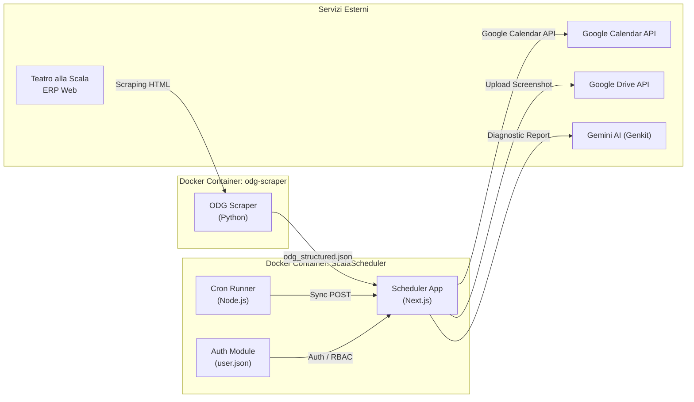

# ScalaScheduler — Chorus Calendar Sync & ODG Scraper

Applicazione integrata per l'estrazione automatica dei programmi di lavoro e degli Ordini del Giorno (ODG) del **Coro del Teatro alla Scala**, sincronizzazione su **Google Calendar** tramite Service Account e archiviazione degli screenshot su **Google Drive**. Include sistema di **autenticazione multi-utente** con approvazione registrazioni, **RBAC** (Admin / Artista del Coro) e associazione granulare utente-calendario.

---

## 🌟 Caratteristiche Principali

1. **Importa Calendario (PDF Quindicinale)**:
   - Parsing client-side con `pdfjs-dist`.
   - Riconoscimento intelligente delle date, fasce orarie, luoghi e note a piè di pagina con asterischi `*`.
   - Tabella eventi interamente modificabile (data, luogo, descrizione, fasce orarie).
   - Esportazione massiva su Google Calendar con gestione automatica slot orari ed eventi di una giornata intera.
   - **Ogni utente vede e può esportare solo verso il proprio calendario associato** (o tutti i calendari per gli Admin).

2. **ODG (Ordine del Giorno da Web)**:
   - Visualizzazione dei dati estratti in tempo reale dalle pagine ERP della Scala.
   - Sincronizzazione intelligente idempotente (upsert basato su SHA-1 content hash e UID univoco).
   - Modalità **Dry Run** per simulare le modifiche prima di applicarle a Google Calendar.

3. **Autenticazione & Gestione Utenti**:
   - **Login obbligatorio** (Access Gate): nessuna funzionalità è accessibile senza autenticazione.
   - **Registrazione utenti** con workflow di approvazione da parte dell'admin.
   - **Ruoli RBAC**: `admin` (accesso completo a tutte le 5 schede) e `user/artista del Coro` (accesso limitato a "Importa Calendario" e "ODG").
   - **Password in chiaro** nel file `user.json` (requisito del progetto).
   - **Associazione utente-calendario**: ogni calendario ha un `ownerUserId` che determina la visibilità per-utente.

4. **ODG Scraper Manager (Area Amministratore)**:
   - Gestione centralizzata della configurazione dello scraper Python: URL target, orari schedulati (`schedules`), toggle `run_on_start`.
   - **Scraping on-demand**: pulsante per forzare l'aggiornamento immediato dei dati senza attendere il cron.
   - Monitoraggio in tempo reale: data ultimo export, righe estratte e stato dei file.

5. **Impostazioni (Area Amministratore)**:
   - **Hub unico per la gestione di tutti i calendari** Google: aggiunta, modifica etichetta, calendarId, tipo, default e **assegnazione proprietario (`ownerUserId`)** tramite menu a tendina degli utenti registrati.
   - **Salvataggio Screenshot su Google Drive**: configurazione cartella, toggle salva-anche-in-locale, verifica connessione con feedback dettagliato degli errori API.

6. **Archiviazione Screenshot su Google Drive**:
   - Salvataggio automatico degli screenshot su cartella Google Drive condivisa con il Service Account.
   - Opzione per attivare/disattivare il salvataggio duplicato in locale (`salvaAncheInLocale`).
   - Verifica automatica dei permessi con **messaggi diagnostici dettagliati** (errori 403/404 Google con messaggio originale API e suggerimenti).

---

## 🛡️ Visibilità Schede per Ruolo

| Scheda | Admin | Artista del Coro |
|--------|:-----:|:-------:|
| **Importa Calendario** | ✅ | ✅ (solo il proprio calendario) |
| **ODG** | ✅ | ✅ |
| **Impostazioni** | ✅ | ❌ |
| **Scraper** | ✅ | ❌ |
| **Utenti** | ✅ | ❌ |

---

## 🏗️ Architettura & Stack Tecnologico

- **Frontend & API**: Next.js 15 (App Router), React 18, TypeScript, TailwindCSS, shadcn/ui, Radix UI.
- **Autenticazione**: Cookie-based session (`auth-token`), file `user.json` con password in chiaro.
- **Integrazioni Google**: `googleapis`, `google-auth-library` (JWT con Service Account).
- **AI Error Diagnostic**: Google Genkit (`gemini-2.5-flash`).
- **ODG Scraper**: Python 3.12, BeautifulSoup4, LXML.
- **Orchestrazione**: Docker Compose / Portainer.



---

## 🚀 Deploy su Portainer (Stack da Repository)

Il progetto è configurato come **Monorepo** per essere deployato direttamente da Portainer tramite la funzione **Stacks > Add stack > Repository**.

### 1. Parametri Stack Portainer
- **Repository URL**: `https://github.com/ciacky85/ScalaScheduler.git`
- **Repository reference**: `refs/heads/main`
- **Compose path**: `docker-compose.yml`

### 2. Mappatura Volumi Host (NAS / Linux Server)
Assicurati che sul tuo host siano presenti le directory:
- `/srv/docker_conf/configs/ScalaScheduler/config` (configurazioni calendari, drive, service-account-key.json, **user.json**)
- `/srv/docker_conf/configs/ScalaScheduler/odg-scraper/config` (file `odg_structured.json`, `config.json`, screenshot)

### 3. File `docker-compose.yml` dello Stack:
```yaml
version: '3.8'

services:
  scala-scheduler:
    build:
      context: ./scheduler
      dockerfile: Dockerfile
    image: ciacky85/scala-scheduler:latest
    container_name: ScalaScheduler
    restart: always
    ports:
      - "3010:3000"
    environment:
      - TZ=Europe/Rome
      - NODE_ENV=production
    volumes:
      - /srv/docker_conf/configs/ScalaScheduler/config:/app/config
      - /srv/docker_conf/configs/ScalaScheduler/config:/app/src/app/config
      - /srv/docker_conf/configs/ScalaScheduler/odg-scraper/config:/app/public
    depends_on:
      - odg-scraper

  odg-scraper:
    build:
      context: ./odg-docker-scraper
      dockerfile: Dockerfile
    image: ciacky85/odg-scraper:latest
    container_name: odg-scraper
    restart: always
    environment:
      - TZ=Europe/Rome
    volumes:
      - /srv/docker_conf/configs/ScalaScheduler/odg-scraper/config:/data
```

> **Nota Docker Image Size**: il Dockerfile usa un build **multi-stage standalone** ottimizzato che riduce l'immagine finale da ~1.5 GB a ~180 MB (taglio dell'88%).

---

## 🔐 Configurazione Google Service Account

1. Posiziona la chiave privata JSON scaricata da Google Cloud Console nel percorso:
   ```
   /srv/docker_conf/configs/ScalaScheduler/config/service-account-key.json
   ```
2. **Google Calendar**: Condividi i tuoi calendari di destinazione con l'email del Service Account (`calendar-scheduler@...iam.gserviceaccount.com`) assegnando i permessi di **"Modifica agli eventi"**.
3. **Google Drive**: Condividi la cartella di destinazione degli screenshot con la stessa email del Service Account con ruolo **"Editor"**, quindi incolla il link della cartella nel tab **Impostazioni** della webapp.
4. **⚠️ IMPORTANTE**: Assicurati che la **Google Drive API** sia **abilitata** nel progetto Google Cloud. Vai su [Google Cloud Console > API & Services > Library](https://console.cloud.google.com/apis/library/drive.googleapis.com) e abilita "Google Drive API". Senza questa abilitazione riceverai errore 403.

---

## 👥 Gestione Utenti

### File `user.json`
Gli utenti sono salvati in `/app/config/user.json` con il seguente schema:
```json
[
  {
    "id": "uuid-v4",
    "username": "email@example.com",
    "nome": "Nome Cognome",
    "email": "email@example.com",
    "password": "password-in-chiaro",
    "role": "admin | user",
    "status": "approved | pending | disabled | rejected",
    "assignedCalendarIds": ["calendarId@group.calendar.google.com"],
    "createdAt": "ISO-8601",
    "approvedAt": "ISO-8601"
  }
]
```

### File `calendars.json`
I calendari sono salvati con un campo `ownerUserId` che associa il calendario al suo proprietario:
```json
[
  {
    "id": "uuid-v4",
    "label": "Calendario Bassi Android Scala",
    "calendarId": "xxx@group.calendar.google.com",
    "tipo": "importaCalendario",
    "predefinito": false,
    "ownerUserId": "uuid-del-proprietario"
  }
]
```

### Workflow
1. Un nuovo utente si registra dal form di login.
2. L'admin riceve la richiesta nella scheda **Utenti** e la approva/rifiuta.
3. L'admin associa i calendari al proprietario nella scheda **Impostazioni** (dropdown utenti).
4. L'utente approvato accede e vede solo i propri calendari.

---

## 📖 Documentazione Completa
Per l'analisi dettagliata di ogni modulo, algoritmo di parsing e logica di sincronizzazione, consulta il file [`ANALISI_TECNICA.md`](./ANALISI_TECNICA.md).
