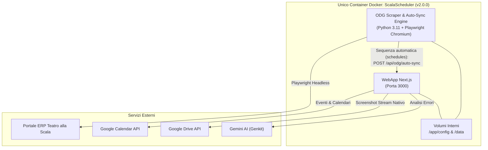

# ScalaScheduler v2.1.0 — Chorus Calendar Sync & ODG Scraper

[](./version.json)
[](./Dockerfile)
[](https://nextjs.org/)
[](https://www.python.org/)

Applicazione integrata per l'estrazione automatica dei programmi di lavoro e degli Ordini del Giorno (ODG) del **Coro del Teatro alla Scala**, sincronizzazione su **Google Calendar**, rilevamento visivo delle modifiche con screenshot di confronto e archiviazione automatica su **Google Drive**.

L'ecosistema (WebApp Next.js + Motore Scraper Python con Playwright Chromium) è consolidato in un **singolo container Docker unificato**, con auto-sync automatico post-scraping e latenza zero su rete locale interna.

---

## 🌟 Caratteristiche Principali

1. **Importa Calendario (PDF Quindicinale)**:
   - Parsing client-side ad alta precisione con `pdfjs-dist`.
   - Riconoscimento intelligente di date, fasce orarie, luoghi e note a piè di pagina con asterischi `*`.
   - Tabella eventi modificabile (data, luogo, descrizione, fasce orarie).
   - Esportazione massiva su Google Calendar con slot orari ed eventi full-day.
   - **Isolamento utente**: ogni artista visualizza ed esporta solo verso il proprio calendario assegnato.

2. **ODG (Ordine del Giorno da Web & Registro Modifiche Visuali)** — **[AGGIORNATO v2.1.0]**:
   - **Doppia Vista Integrata**:
     - **Programma ODG & Push**: tabella in tempo reale con dati ERP, calcolo automatico orari con 8 livelli di fallback, modalità **Dry Run** e push su Google Calendar.
     - **Registro Modifiche & Screenshot**: visualizzatore cronologico di tutte le revisioni intervenute durante la giornata.
   - **Visual Diffing & Rilevamento Modifiche**:
     - Lo scraper scatta la baseline iniziale della giornata (`YYYY-MM-DD.png`) alle 00:02.
     - Nei cicli successivi calcola l'hash dei contenuti: se la pagina subisce variazioni, cattura lo scatto modificato (`YYYY-MM-DD_HHmm_edit.png`); se identica, evita scatti ridondanti.
   - **Viewer Avanzato**:
     - Dialog modale a schermo intero con zoom e dettagli temporali.
     - Confronto visivo prima/dopo tra baseline e scatto modificato.
     - Link diretto alla cartella Google Drive e download del PNG originale.
     - Streaming locale sicuro ad alta efficienza tramite endpoint dedicato `/api/screenshots/image`.

3. **Motore di Sincronizzazione Google Calendar Centralizzato (`odg-sync.ts`)** — **[NUOVO v2.1.0]**:
   - Motore unificato e DRY per il push manuale (`/api/odg/push`) e l'auto-sync (`/api/odg/auto-sync`).
   - Sincronizzazione idempotente con deduplicazione avanzata basata su SHA-1 content hash e UID univoco.

4. **Architettura Unificata a Singolo Container & Auto-Sync** — **[AGGIORNATO v2.1.0]**:
   - WebApp e Scraper Python convivono nello stesso container (`node:20-bookworm-slim`).
   - Comunicazione diretta su `localhost:3000` a latenza zero.
   - Il demone Python gestisce gli orari pianificati ed esegue la sequenza: scraping ERP ➔ screenshot diffing ➔ push automatico su Google Calendar (`POST /api/odg/auto-sync`) ➔ sincronizzazione Drive (`POST /api/screenshots/sync`).
   - Eliminato completamente il container cron separato e rimossi script ridondanti.

5. **Archiviazione Screenshot Google Drive ad Alte Prestazioni**:
   - **Confronto cartelle a due fasi (Folder-First Diff)**: pre-carica l'elenco cartelle su Drive con una singola chiamata e salta istantaneamente centinaia di cartelle storiche già allineate a costo zero millisecondi.
   - **Upload in Stream Nativo**: streaming diretto da disco tramite `fs.createReadStream`, senza accumulo in memoria virtuale.
   - **Quota Utente OAuth 2.0**: supporto alle credenziali OAuth 2.0 in `drive_config.json` per superare il limite di quota storage imposto da Google ai Service Account.

6. **Autenticazione & Gestione Utenti (RBAC)**:
   - Login obbligatorio con cookie-based session (`auth-token`).
   - Registrazione utenti con flusso di approvazione/rifiuto dell'amministratore.
   - Ruoli: `admin` (accesso completo) e `user` (accesso limitato a Importa Calendario e ODG).
   - Associazione granulare `ownerUserId` per ciascun calendario Google.

7. **Sistema di Versioning Tracciato**:
   - Badge di versione visibile in testata sia nella schermata di login che nella dashboard.
   - File di allineamento sorgente [`version.json`](./version.json) nella radice del progetto.

---

## 🛡️ Visibilità Schede per Ruolo

| Scheda | Admin | Artista del Coro |
|--------|:-----:|:-------:|
| **Importa Calendario** | ✅ | ✅ (solo il proprio calendario) |
| **ODG** | ✅ | ✅ |
| **Impostazioni** | ✅ | ❌ |
| **Scraper Manager** | ✅ | ❌ |
| **Gestione Utenti** | ✅ | ❌ |

---

## 🏗️ Architettura & Stack Tecnologico

- **Frontend & API**: Next.js 15 (App Router), React 18, TypeScript, TailwindCSS, shadcn/ui.
- **Scraper Engine**: Python 3.11, Playwright (Chromium headless), BeautifulSoup4, LXML, Pillow.
- **Integrazioni Google**: `googleapis`, `google-auth-library` (OAuth 2.0 & Service Account JWT).
- **AI Diagnostics**: Google Genkit (`gemini-2.5-flash`).
- **Orchestrazione**: Docker Compose / Portainer (Single-Container Multi-Stage).



---

## 🚀 Deploy su Portainer (Stack da Repository Git)

Il progetto è pronto per il deploy immediato da Portainer tramite **Stacks > Add stack > Repository**.

### 1. Parametri Stack Portainer
- **Repository URL**: `https://github.com/ciacky85/ScalaScheduler.git`
- **Repository reference**: `refs/heads/main`
- **Compose path**: `docker-compose.yml`

### 2. Mappatura Volumi Host
Sul server host (NAS / Linux Server) le cartelle rimangono esattamente quelle usate in precedenza:
- `/srv/docker_conf/configs/ScalaScheduler/config` ➔ montata in `/app/config` (contiene `calendari.json`, `drive_config.json`, `service-account-key.json`, `users.json`)
- `/srv/docker_conf/configs/ScalaScheduler/odg-scraper/config` ➔ montata in `/data` (contiene `odg_structured.json`, `config.json`, cartella `odg_shots/`)

### 3. File `docker-compose.yml` Unificato:
```yaml
version: '3.8'

services:
  scala-scheduler:
    build:
      context: .
      dockerfile: Dockerfile
    container_name: ScalaScheduler
    restart: unless-stopped
    ports:
      - "3010:3000"
    environment:
      - TZ=Europe/Rome
      - NODE_ENV=production
      - SCHEDULER_API_URL=http://localhost:3000
    volumes:
      - /srv/docker_conf/configs/ScalaScheduler/config:/app/config
      - /srv/docker_conf/configs/ScalaScheduler/odg-scraper/config:/data
```

---

## 🔐 Configurazione Google Drive & Calendar

### 1. Service Account (Google Calendar)
1. Posiziona il file `service-account-key.json` in:
   ```
   /srv/docker_conf/configs/ScalaScheduler/config/service-account-key.json
   ```
2. Condividi i tuoi calendari Google con l'email del Service Account (`calendar-scheduler@...iam.gserviceaccount.com`) assegnando i permessi di **"Modifica agli eventi"**.

### 2. Google Drive & Quota Storage (OAuth 2.0)
I Service Account non dispongono di quota di archiviazione personale su cartelle Google Drive standard. Per salvare gli screenshot:
1. Configura il file `/srv/docker_conf/configs/ScalaScheduler/config/drive_config.json`:
   ```json
   {
     "googleDriveFolderUrl": "https://drive.google.com/drive/folders/ID_CARTELLA",
     "googleDriveFolderId": "ID_CARTELLA",
     "salvaAncheInLocale": true,
     "oauthClientId": "TUO_CLIENT_ID.apps.googleusercontent.com",
     "oauthClientSecret": "TUO_CLIENT_SECRET",
     "oauthRefreshToken": "1//TUO_REFRESH_TOKEN"
   }
   ```
2. L'upload utilizzerà le credenziali utente con la quota del tuo account Google Drive, garantendo upload affidabili e senza limiti.

---

## 👥 Gestione Utenti e Calendari

- **File `users.json`** (`/app/config/users.json`): gestisce gli account, ruoli (`admin`/`user`) e stato (`approved`/`pending`).
- **File `calendars.json`** (`/app/config/calendari.json`): associa a ciascun calendario il relativo `ownerUserId`.
- L'amministratore può approvare gli utenti e collegare i calendari direttamente dalla scheda **Impostazioni** e **Utenti**.

---

## 📖 Documentazione Completa
Per i dettagli architetturali approfonditi, consultare [`ANALISI_TECNICA.md`](./ANALISI_TECNICA.md).
